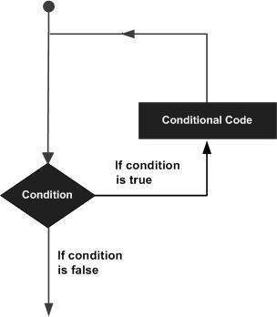
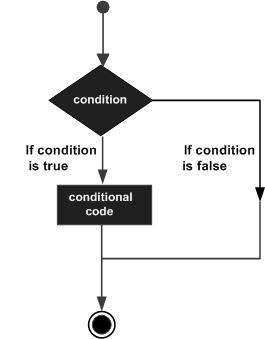
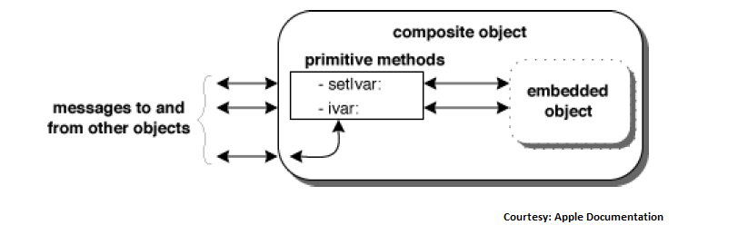

# 基本Objective-C

## 概述

------

Objective-C 是一种通用的、面向对象的编程语言，它在 C 编程语言中添加了 Smalltalk 风格的消息传递。 这是 Apple 用于 OS X 和 iOS 操作系统及其各自的 API Cocoa 和 Cocoa Touch 的主要编程语言。 本参考资料将带您通过简单实用的方法学习 Objective-C 编程语言。2014年Apple推出了Swift，至今Swift不断发展更新完善，Apple平台正全面向Swift迁移，但与不用担心老Objective-C项目不被支持，您可以在同一Xcode项目中同时使用Objectice-C和Swift。

此参考资料专为初学者准备，可帮助他们了解与 Objective-C 编程语言相关的基本概念和高级概念。

在您开始使用本参考资料中提供的各种类型的示例进行练习之前，最好有一些C语言编程基础。


## 环境设置

------

### 本地环境设置

你需要在你的电脑上安装 **文本编辑器** 和 **GCC 编译器**。

------

### 文本编辑器

这将用于键入您的程序。 一些编辑器的示例包括 Windows 记事本、操作系统编辑命令、Brief、Epsilon、EMACS 和 vim 或 vi。

文本编辑器的名称和版本可能因操作系统而异。 例如，记事本将在 Windows 上使用，而 vim 或 vi 既可以在 Windows 上使用，也可以在 Linux 或 UNIX 上使用。

您使用编辑器创建的文件称为源文件并包含程序源代码。 Objective-C 程序的源文件通常以扩展名"**.m**"命名。

在开始你的编程之前，确保你有一个文本编辑器，并且你有足够的经验来编写一个计算机程序，将它保存在一个文件中，编译它并最终执行它。

------

### GCC 编译器

写在源文件中的源代码是程序的人类可读源代码。 它需要被"编译"成机器语言，这样你的 CPU 才能真正按照给定的指令执行程序。

此 GCC 编译器将用于将您的源代码编译成最终的可执行程序。 假设您具有关于编程语言编译器的基本知识。

GCC 编译器可在各种平台上免费使用，下面介绍在各种平台上设置的过程。

------

### 在 UNIX/Linux 上安装

第一步是安装 gcc 和 gcc Objective-C 包。 这是由

```
$ su - 
$ yum install gcc
$ yum install gcc-objc
```

下一步是使用以下命令设置包依赖关系

```
$ yum install make libpng libpng-devel libtiff libtiff-devel libobjc 
   libxml2 libxml2-devel libX11-devel libXt-devel libjpeg libjpeg-devel
```

为了获得 Objective-C 的全部功能，请下载并安装 GNUStep。 这可以通过从 [http://main.gnustep.org/resources/downloads.php](http://wwwmain.gnustep.org/resources/downloads.php?site=ftp%3A%2F%2Fftp.gnustep.org%2Fpub%2Fgnustep%2F#core/) 下载软件包来完成。

现在，我们需要切换到下载的文件夹并解压文件 

```
$ tar xvfz gnustep-startup-.tar.gz
```

现在，我们需要切换到使用创建的文件夹 gnustep-startup 

```
$ cd gnustep-startup-<version>
 
```

接下来，我们需要配置构建过程 

```
$ ./configure
 
```

然后，我们可以通过 

```
$ make
 
```

我们最终需要通过以下方式设置环境 

```
$ . /usr/GNUstep/System/Library/Makefiles/GNUstep.sh
```

我们有一个 helloWorld.m Objective-C 如下 

```
#import <Foundation/Foundation.h>

int main (int argc, const char * argv[]) {
   NSAutoreleasePool * pool = [[NSAutoreleasePool alloc] init];
   
   NSLog (@"hello world");
   [pool drain];
   return 0;
}
 
```

现在，我们可以编译并运行一个 Objective-C 文件 helloWorld.m，方法是使用 cd 切换到包含该文件的文件夹，然后使用以下步骤 

```
$ gcc `gnustep-config --objc-flags` 
-L/usr/GNUstep/Local/Library/Libraries 
-lgnustep-base helloWorld.m -o helloWorld
$ ./helloWorld
 
```

我们可以看到如下输出 

```
2013-09-07 10:48:39.772 tutorialsPoint[12906] hello world
```

------

### 在 Mac OS 上安装

如果您使用 Mac OS X，获得 GCC 的最简单方法是从 Apple 网站下载 Xcode 开发环境并按照简单的安装说明进行操作。 一旦你设置了 Xcode，你就可以使用 GNU 编译器来编译 C/C++。

Xcode 目前在 [developer.apple.com/technologies/tools/](https://developer.apple.com/technologies/tools/) 上可用。

------

### 在 Windows 上安装

为了在windows上运行Objective-C程序，我们需要安装MinGW和GNUStep Core。 两者都可以在 https://www.gnu.org/software/gnustep/windows/installer.html 上买到。

首先，我们需要安装 MSYS/MinGW 系统包。 然后，需要安装 GNUstep 核心包。 两者都提供了一个 windows 安装程序。

然后通过选择 Start -> All Programs -> GNUstep -> Shell 来使用 Objective-C 和 GNUstep

切换到包含 helloWorld.m 的文件夹

可以使用 

```
$ gcc `gnustep-config --objc-flags` 
-L /GNUstep/System/Library/Libraries hello.m -o hello -lgnustep-base -lobjc
```

可以使用 

```
./hello.exe
```

得到以下输出 

```
2013-09-07 10:48:39.772 tutorialsPoint[1200] hello world
```


## 程序结构

------

### Objective-C Hello World 示例

一个 Objective-C 程序基本上由以下部分组成 

- 预处理器命令
- 接口
- 执行
- 方法
- 变量
- 声明和表达式
- 注释

让我们看一个打印"Hello World"字样的简单代码 

```objective-c
#import <Foundation/Foundation.h>

@interface SampleClass:NSObject
- (void)sampleMethod;
@end

@implementation SampleClass

- (void)sampleMethod {
   NSLog(@"Hello, World! \n");
}

@end

int main() {
   /* my first program in Objective-C */
   SampleClass *sampleClass = [[SampleClass alloc]init];
   [sampleClass sampleMethod];
   return 0;
}
 
```

让我们看看上面程序的各个部分 

- 程序 *#import <Foundation/Foundation.h>* 的第一行是预处理器命令，它告诉 Objective-C 编译器在进行实际编译之前包含 Foundation.h 文件。
- 下一行 *@interface SampleClass:NSObject* 展示了如何创建一个接口。 它继承了NSObject，它是所有对象的基类。
- 下一行 *- (void)sampleMethod;* 展示了如何声明一个方法。
- 下一行 *@end* 标记接口的结束。
- 下一行 *@implementation SampleClass* 展示了如何实现接口SampleClass。
- 下一行 *- (void)sampleMethod{}* 显示了 sampleMethod 的实现。
- 下一行 *@end* 标志着一个实现的结束。
- 下一行 *int main()* 是程序开始执行的 main 函数。
- 下一行 /*...*/ 将被编译器忽略，它已被放置在程序中添加附加注释。 所以这样的行在程序中被称为注释。
- 下一行 *NSLog(...)* 是 Objective-C 中可用的另一个函数，它会导致消息"Hello, World!" 显示在屏幕上。
- 下一行 **return 0;** 终止 main() 函数并返回值 0。

------

### Compile & Execute Objective-C Program

现在当我们编译并运行程序时，我们将得到如下结果。

```objective-c
2017-10-06 07:48:32.020 demo[65832] Hello, World!
```


## 基本语法

------

### Objective-C 中的标记

Objective-C 程序由各种标记组成，标记可以是关键字、标识符、常量、字符串文字或符号。 例如，以下 Objective-C 语句由六个标记组成

```objective-c
NSLog(@"Hello, World! \n");
 
```

各个标记是

```objective-c
NSLog
@
(
   "Hello, World! \n"
)
;
 
```

------

### 分号;

在Objective-C程序中，分号是语句的结束符。 也就是说，每个单独的语句必须以分号结束。 它表示一个逻辑实体的结束。

例如，下面是两个不同的语句

```objective-c
NSLog(@"Hello, World! \n");
return 0;
 
```

------

### 注释

注释就像 Objective-C 程序中的帮助文本，它们会被编译器忽略。 它们以 /* 开头并以字符 */ 结束，如下所示

```objective-c
/* my first program in Objective-C */
```

您不能在注释中添加注释，并且它们不会出现在字符串或字符文字中。

------

### 标识符

Objective-C 标识符是用于标识变量、函数或任何其他用户定义项的名称。 标识符以字母 A 到 Z 或 a 到 z 或下划线 _ 开头，后跟零个或多个字母、下划线和数字（0 到 9）。

Objective-C 不允许在标识符中使用标点符号，例如 @、$ 和 %。 Objective-C 是一种**区分大小写**的编程语言。 因此，*Manpower* 和 *manpower* 是 Objective-C 中的两个不同标识符。 以下是可接受的标识符的一些示例

```
mohd       zara    abc   move_name  a_123
myname50   _temp   j     a23b9      retVal
```

------

### 保留关键字

下面的列表显示了 Objective-C 中的一些保留字。 这些保留字不能用作常量或变量或任何其他标识符名称。

| auto     | else               | long      | switch         |
| -------- | ------------------ | --------- | -------------- |
| break    | enum               | register  | typedef        |
| case     | extern             | return    | union          |
| char     | float              | short     | unsigned       |
| const    | for                | signed    | void           |
| continue | goto               | sizeof    | volatile       |
| default  | if                 | static    | while          |
| do       | int                | struct    | _Packed        |
| double   | protocol           | interface | implementation |
| NSObject | NSInteger          | NSNumber  | CGFloat        |
| property | nonatomic;         | retain    | strong         |
| weak     | unsafe_unretained; | readwrite | readonly       |

------

### Objective-C 中的空格

仅包含空格且可能带有注释的行称为空行，Objective-C 编译器会完全忽略它。

空格是 Objective-C 中用来描述空格、制表符、换行符和注释的术语。 空格将语句的一部分与另一部分分开，使编译器能够识别语句中的一个元素（例如 int）在哪里结束以及下一个元素在哪里开始。 因此，在下面的语句中

```objective-c
int age;
```

int 和 age 之间必须至少有一个空白字符（通常是一个空格），编译器才能区分它们。 另一方面，在以下声明中，

```objective-c
fruit = apples + oranges;   // get the total fruit
 
```

fruit 和 = 之间，或 = 和 apples 之间不需要空格字符，但如果您希望提高可读性，可以随意包含一些空格字符。


### 数据类型

------

在 Objective-C 编程语言中，数据类型是指用于声明不同类型的变量或函数的广泛系统。 变量的类型决定了它在存储中占用多少空间以及如何解释存储的位模式。

Objective-C 中的类型可以分为以下几类

| 序号 |                         类型 & 描述                          |
| :--- | :----------------------------------------------------------: |
| 1    | **基本类型**它们是算术类型，由两种类型组成:(a) 整数类型和 (b) 浮点类型。 |
| 2    | **枚举类型−**它们又是算术类型，用于定义在整个程序中只能分配特定离散整数值的变量。 |
| 3    |       **类型 void**类型说明符*void* 表示没有可用的值。       |
| 4    | **派生类型**它们包括 (a) 指针类型，(b) 数组类型，(c) 结构类型，(d) 联合类型和 (e) 函数类型。 |

数组类型和结构类型统称为聚合类型。 函数的类型指定了函数返回值的类型。 我们将在下一节中看到基本类型，而其他类型将在接下来的章节中介绍。

------

### 整数类型

下表为您提供了有关标准整数类型及其存储大小和取值范围的详细信息

| 类型           |  存储大小  | 取值范围                                             |
| :------------- | :--------: | :--------------------------------------------------- |
| char           |   1字节    | -128 到 127 或 0 到 255                              |
| unsigned char  |   1字节    | 0 到 255                                             |
| signed char    |   1字节    | -128 到 127                                          |
| int            | 2 或 4字节 | -32,768 至 32,767 或 -2,147,483,648 至 2,147,483,647 |
| unsigned int   | 2 或 4字节 | 0 到 65,535 或 0 到 4,294,967,295                    |
| short          |   2字节    | -32,768 到 32,767                                    |
| unsigned short |   2字节    | 0 到 65,535                                          |
| long           |   4字节    | -2,147,483,648 到 2,147,483,647                      |
| unsigned long  |   4字节    | 0 到 4,294,967,295                                   |

要在特定平台上获取类型或变量的确切大小，可以使用 **sizeof** 运算符。表达式 *sizeof(type)* 产生对象或类型的存储大小（以字节为单位）。 以下是在任何机器上获取 int 类型大小的示例

```objective-c
#import <Foundation/Foundation.h>

int main() {
   NSLog(@"Storage size for int : %d \n", sizeof(int));
   return 0;
}
 
```

当你编译并执行上面的程序时，它在 Linux 上产生如下结果

```objective-c
2013-09-07 22:21:39.155 demo[1340] Storage size for int : 4 
```

------

### 浮点类型

下表为您提供了有关标准浮点类型的详细信息，包括存储大小和值范围及其精度

|    类型     | 存储大小 |        取值范围        |      精度      |
| :---------: | :------: | :--------------------: | :------------: |
|    float    |  4字节   |    1.2E-38到3.4E+38    |    6 位小数    |
|   double    |  8字节   |   2.3E-308到1.7E+308   | 小数点后 15 位 |
| long double |  10字节  | 3.4E-4932 到 1.1E+4932 |   19 位小数    |

头文件 float.h 定义了宏，允许您在程序中使用这些值和有关实数二进制表示的其他详细信息。 以下示例将打印 float 类型占用的存储空间及其范围值

```objective-c
#import <Foundation/Foundation.h>

int main() {
   NSLog(@"Storage size for float : %d \n", sizeof(float));
   return 0;
}
 
```

当你编译并执行上面的程序时，它在 Linux 上产生如下结果

```objective-c
2013-09-07 22:22:21.729 demo[3927] Storage size for float : 4 
```

------

### void 类型

void 类型指定没有可用的值。 用于三种情况

| 序号 |                          类型和描述                          |
| :--- | :----------------------------------------------------------: |
| 1    | **函数返回 void**在 Objective-C 中有很多函数不返回值，或者你可以说它们返回 void。 没有返回值的函数的返回类型为 void。 例如，**void exit (int status);** |
| 2    | **函数参数为 void**在 Objective-C 中有许多不接受任何参数的函数。 没有参数的函数可以接受为 void。 例如，**int rand(void);** |

此时您可能还不理解 void 类型，所以让我们继续，我们将在后续章节中介绍这些概念。


## 变量

------

变量只不过是给我们的程序可以操作的存储区域的名称。 Objective-C 中的每个变量都有一个特定的类型，它决定了变量内存的大小和布局； 该内存中可以存储的值的范围； 以及可以应用于变量的一组操作。

变量名可以由字母、数字和下划线字符组成。 它必须以字母或下划线开头。 大写字母和小写字母是不同的，因为 Objective-C 是区分大小写的。 基于上一章讲解的基本类型，会有以下基本变量类型

| 序号 |               类型 & 描述                |
| :--- | :--------------------------------------: |
| 1    | **char**通常是一个八位字节（一个字节）。 |
| 2    |      **int**机器最自然的整数大小。       |
| 3    |         **float**单精度浮点值。          |
| 4    |         **double**双精度浮点值。         |
| 5    |          **void**表示没有类型。          |

Objective-C 编程语言还允许定义各种其他类型的变量，我们将在后续章节中介绍这些变量，如枚举、指针、数组、结构、联合等。本章我们只研究基本的变量类型。

------

### Objective-C 中的变量定义

变量定义意味着告诉编译器在何处以及为变量创建多少存储空间。 变量定义指定一种数据类型并包含该类型的一个或多个变量的列表，如下所示

```objective-c
type variable_list;
 
```

这里，**type**必须是有效的Objective-C数据类型，包括char、w_char、int、float、double、bool或任何用户定义的对象等，以及**variable_list** 可以由一个或多个用逗号分隔的标识符名称组成。 此处显示了一些有效的声明

```objective-c
int    i, j, k;
char   c, ch;
float  f, salary;
double d;
 
```

行 **int i, j, k;** 声明和定义了变量 i, j 和 k; 它指示编译器创建名为 i、j 和 k 的 int 类型变量。

变量可以在它们的声明中被初始化（分配一个初始值）。 初始化器由一个等号和一个常量表达式组成，如下所示

```
type variable_name = value;
 
```

Some examples are

```objective-c
extern int d = 3, f = 5;    // declaration of d and f. 
int d = 3, f = 5;           // definition and initializing d and f. 
byte z = 22;                // definition and initializes z. 
char x = 'x';               // the variable x has the value 'x'.
 
```

对于没有初始化器的定义:具有静态存储持续时间的变量被隐式初始化为 NULL（所有字节的值为 0）； 所有其他变量的初始值未定义。

------

### Objective-C 中的变量声明

变量声明向编译器保证存在一个具有给定类型和名称的变量，以便编译器继续进行进一步的编译，而无需有关该变量的完整详细信息。 变量声明仅在编译时有意义，编译器在程序链接时需要实际的变量声明。

当您使用多个文件并且您在其中一个文件中定义您的变量时，变量声明很有用，这将在程序链接时可用。 您将使用 **extern** 关键字在任何地方声明变量。 虽然你可以在你的 Objective-C 程序中多次声明一个变量，但它只能在文件、函数或代码块中定义一次。

------

### 示例

试试下面的例子，其中变量已经在顶部声明，但它们已经在主函数内部定义和初始化

```objective-c
#import <Foundation/Foundation.h>

// Variable declaration:
extern int a, b;
extern int c;
extern float f;

int main () {
  /* variable definition: */
  int a, b;
  int c;
  float f;
 
  /* actual initialization */
  a = 10;
  b = 20;
  
  c = a + b;
  NSLog(@"value of c : %d \n", c);

  f = 70.0/3.0;
  NSLog(@"value of f : %f \n", f);
 
  return 0;
}
 
```

当上面的代码被编译和执行时，会产生如下结果

```objective-c
2013-09-07 22:43:31.695 demo[14019] value of c : 30 
2013-09-07 22:43:31.695 demo[14019] value of f : 23.333334 
 
```

相同的概念适用于函数声明，您在函数声明时提供函数名称，并且可以在其他任何地方给出其实际定义。 在下面的例子中，它是使用 C 函数解释的，正如你所知，Objective-C 也支持 C 风格的函数

```objective-c
// function declaration
int func();

int main() {
   // function call
   int i = func();
}

// function definition
int func() {
   return 0;
}
 
```

------

### Objective-C 中的左值和右值

Objective-C中有两种表达式

- **lvalue** 引用内存位置的表达式称为"左值"表达式。 左值可能出现在赋值的左侧或右侧。
- **rvalue** 术语右值是指存储在内存中某个地址的数据值。 右值是一个不能被赋值的表达式，这意味着右值可能出现在赋值的右侧，但不会出现在左侧。

变量是左值，因此可能出现在赋值语句的左侧。 数字文字是右值，因此可能无法分配并且不能出现在左侧。 以下是有效声明

```objective-c
int g = 20;
```

但以下不是有效的语句，会产生编译时错误

```objective-c
10 = 20;
```


## 常量

------

常量指的是程序在执行期间不能改变的固定值。 这些固定值也称为**字面量**。

常量可以是任何基本数据类型，例如*整数常量、浮点常量、字符常量或字符串文字*。 还有枚举常量。

**常量** 就像常规变量一样对待，只是它们的值在定义后不能修改。

------

### 整型字面量

整型字面量可以是十进制、八进制或十六进制常量。 前缀指定基数或基数:十六进制为 0x 或 0X，八进制为 0，十进制为空。

整数文字也可以有一个后缀，它是 U 和 L 的组合，分别表示无符号和长整型。 后缀可以是大写或小写，并且可以是任何顺序。

这里有一些整型字面量的例子

```objective-c
212         /* Legal */
215u        /* Legal */
0xFeeL      /* Legal */
078         /* Illegal: 8 is not an octal digit */
032UU       /* Illegal: cannot repeat a suffix */
 
```

以下是各种类型的整数字面量的其他示例

```objective-c
85         /* decimal */
0213       /* octal */
0x4b       /* hexadecimal */
30         /* int */
30u        /* unsigned int */
30l        /* long */
30ul       /* unsigned long */
 
```

------

### 浮点字面量

浮点字面值有整数部分、小数点、小数部分和指数部分。 您可以用十进制形式或指数形式表示浮点文字。

当使用小数形式表示时，您必须包括小数点、指数或两者，而当使用指数形式表示时，您必须包括整数部分、小数部分或两者。 带符号的指数由 e 或 E 引入。

下面是一些浮点字面量的例子

```objective-c
3.14159       /* Legal */
314159E-5L    /* Legal */
510E          /* Illegal: incomplete exponent */
210f          /* Illegal: no decimal or exponent */
.e55          /* Illegal: missing integer or fraction */
 
```

------

### 字符常量

字符文字包含在单引号中，例如，'x'，并且可以存储在 **char** 类型的简单变量中。

字符文字可以是纯字符（例如，'x'）、转义序列（例如，'\t'）或通用字符（例如，'\u02C0'）。

C 语言中有些字符前面加反斜杠时会有特殊的含义，用于表示换行符（\n）或制表符（\t）。 在这里，您有一些此类转义序列代码的列表

| 转义序列    |         含义         |
| :---------- | :------------------: |
| \\          |        \ 字符        |
| \'          |        ' 字符        |
| \"          |        " 字符        |
| \?          |        ? 字符        |
| \a          |      警报或响铃      |
| \b          |        退格键        |
| \f          |         换页         |
| \n          |        换行符        |
| \r          |         回车         |
| \t          |      水平制表符      |
| \v          |      垂直制表符      |
| \ooo        |  一到三位的八进制数  |
| \xhh 。 . . | 一位或多位十六进制数 |

以下是显示少量转义序列字符的示例

```objective-c
#import <Foundation/Foundation.h>

int main() {
   NSLog(@"Hello\tWorld\n\n");
   return 0;
}
 
```

当上面的代码被编译和执行时，会产生如下结果

```objective-c
2013-09-07 22:17:17.923 demo[17871] Hello	World
```

------

### 字符串文字

字符串文字或常量用双引号""括起来。 字符串包含类似于字符文字的字符:纯字符、转义序列和通用字符。 您可以使用字符串文字将长行分成多行并使用空格分隔它们。

这里有一些字符串文字的例子。 所有三种形式都是相同的字符串。

```objective-c
"hello, dear"

"hello, \

dear"

"hello, " "d" "ear"
 
```

------

### 定义常量

C中定义常量有两种简单的方法

- 使用 **#define** 预处理器。
- 使用 **const** 关键字。

------

### #define 预处理器

下面是使用 #define 预处理器定义常量的形式

```objective-c
#define identifier value
 
```

下面的例子详细解释了

```objective-c
#import <Foundation/Foundation.h>

#define LENGTH 10   
#define WIDTH  5
#define NEWLINE '\n'

int main() {
   int area;
   area = LENGTH * WIDTH;
   NSLog(@"value of area : %d", area);
   NSLog(@"%c", NEWLINE);

   return 0;
}
 
```

当上面的代码被编译和执行时，会产生如下结果

```objective-c
2013-09-07 22:18:16.637 demo[21460] value of area : 50
2013-09-07 22:18:16.638 demo[21460] 
 
```

------

### const 关键字

可以使用 **const**前缀来声明特定类型的常量，如下所示

```objective-c
const type variable = value;
 
```

下面的例子详细解释了

```objective-c
#import <Foundation/Foundation.h>

int main() {
   const int  LENGTH = 10;
   const int  WIDTH  = 5;
   const char NEWLINE = '\n';
   int area;  
   
   area = LENGTH * WIDTH;
   NSLog(@"value of area : %d", area);
   NSLog(@"%c", NEWLINE);

   return 0;
}
 
```

当上面的代码被编译和执行时，会产生如下结果

```objective-c
2013-09-07 22:19:24.780 demo[25621] value of area : 50
2013-09-07 22:19:24.781 demo[25621] 
```

请注意，以大写形式定义常量是一种很好的编程习惯。


## 运算符

运算符是一个符号，它告诉编译器执行特定的数学或逻辑操作。 Objective-C 语言内置了丰富的运算符，提供了以下类型的运算符

- 算术运算符
- 关系运算符
- 逻辑运算符
- 位运算符
- 赋值运算符
- 其他运算符

------

### 算术运算符

下表列出了 Objective-C 语言支持的所有算术运算符。 假设变量**A**为10，变量**B**为20，则

[显示示例](https://www.w3ccoo.com/objective_c/objective_c_arithmetic_operators.html)

| 运算符 |               描述               |       示例       |
| :----: | :------------------------------: | :--------------: |
|   +    |          添加两个操作数          | A + B 会得到 30  |
|   -    | 从第一个操作数中减去第二个操作数 | A - B 会得到 -10 |
|   *    |          两个操作数相乘          | A * B 会得到 200 |
|   /    |           分子除以分母           |  B / A 会得到 2  |
|   %    |   模数运算符和整数除法后的余数   |  B % A 会得到 0  |
|   ++   |      自增运算符将整数值加一      |  A++ 会得到 11   |
|   --   |      自减运算符将整数值减一      |   A-- 会得到 9   |

<iframe id="aswift_4" name="aswift_4" browsingtopics="true" sandbox="allow-forms allow-popups allow-popups-to-escape-sandbox allow-same-origin allow-scripts allow-top-navigation-by-user-activation" width="907" height="0" frameborder="0" marginwidth="0" marginheight="0" vspace="0" hspace="0" allowtransparency="true" scrolling="no" allow="attribution-reporting; run-ad-auction" src="https://googleads.g.doubleclick.net/pagead/ads?client=ca-pub-2533243013167625&amp;output=html&amp;h=280&amp;adk=2783031302&amp;adf=552384098&amp;pi=t.aa~a.2153376248~rp.4&amp;w=907&amp;abgtt=6&amp;fwrn=4&amp;fwrnh=100&amp;lmt=1723462535&amp;rafmt=1&amp;to=qs&amp;pwprc=9883269336&amp;format=907x280&amp;url=https%3A%2F%2Fwww.w3ccoo.com%2Fobjective_c%2Fobjective_c_operators.html&amp;fwr=0&amp;pra=3&amp;rpe=1&amp;resp_fmts=3&amp;wgl=1&amp;fa=40&amp;uach=WyJtYWNPUyIsIjE0LjUuMCIsImFybSIsIiIsIjEyNy4wLjY1MzMuMTAwIixudWxsLDAsbnVsbCwiNjQiLFtbIk5vdClBO0JyYW5kIiwiOTkuMC4wLjAiXSxbIkdvb2dsZSBDaHJvbWUiLCIxMjcuMC42NTMzLjEwMCJdLFsiQ2hyb21pdW0iLCIxMjcuMC42NTMzLjEwMCJdXSwwXQ..&amp;dt=1723462535674&amp;bpp=1&amp;bdt=192&amp;idt=1&amp;shv=r20240807&amp;mjsv=m202408060101&amp;ptt=9&amp;saldr=aa&amp;abxe=1&amp;cookie_enabled=1&amp;eo_id_str=ID%3D56458f69164f2039%3AT%3D1723222122%3ART%3D1723462460%3AS%3DAA-Afjb4707nJRhwvHL0cNANdNA_&amp;prev_fmts=0x0%2C907x280%2C225x600&amp;nras=2&amp;correlator=647498562459&amp;frm=20&amp;pv=1&amp;u_tz=480&amp;u_his=3&amp;u_h=1080&amp;u_w=1920&amp;u_ah=1055&amp;u_aw=1920&amp;u_cd=24&amp;u_sd=2&amp;dmc=8&amp;adx=252&amp;ady=1224&amp;biw=1445&amp;bih=968&amp;scr_x=0&amp;scr_y=0&amp;eid=44759876%2C44759927%2C44759837%2C31085989%2C95334524%2C95334829%2C95337868%2C95339233%2C95336267%2C95339400%2C31078663%2C31078665%2C31078668%2C31078670&amp;oid=2&amp;pvsid=1226849764661955&amp;tmod=1966472043&amp;uas=0&amp;nvt=1&amp;ref=https%3A%2F%2Fwww.w3ccoo.com%2Fobjective_c%2Fobjective_c_overview.html&amp;fc=1920&amp;brdim=232%2C25%2C232%2C25%2C1920%2C25%2C1460%2C1055%2C1460%2C968&amp;vis=1&amp;rsz=%7C%7Cs%7C&amp;abl=NS&amp;fu=128&amp;bc=31&amp;bz=1&amp;td=1&amp;tdf=2&amp;psd=W251bGwsbnVsbCxudWxsLDNd&amp;nt=1&amp;ifi=5&amp;uci=a!5&amp;btvi=1&amp;fsb=1&amp;dtd=4" data-google-container-id="a!5" tabindex="0" title="Advertisement" aria-label="Advertisement" data-google-query-id="CNzo6aGu74cDFc1EwgUdN4k4Fw" data-load-complete="true" style="box-sizing: inherit; left: 0px; top: 0px; border: 0px; width: 907px; height: 0px;"></iframe>

------

### 关系运算符

下表显示了 Objective-C 语言支持的所有关系运算符。 假设变量**A**为10，变量**B**为20，则

[显示示例](https://www.w3ccoo.com/objective_c/objective_c_relational_operators.html)

| 运算符 |                             描述                             |       示例        |
| :----: | :----------------------------------------------------------: | :---------------: |
|   ==   |     检查两个操作数的值是否相等； 如果是，则条件变为真。      | (A == B) 不为真。 |
|   !=   |   检查两个操作数的值是否相等； 如果值不相等，则条件为真。    |  (A != B) 为真。  |
|   >    | 检查左操作数的值是否大于右操作数的值； 如果是，则条件变为真。 | (A > B) 不为真。  |
|   <    | 检查左操作数的值是否小于右操作数的值； 如果是，则条件变为真。 |  (A < B) 为真。   |
|   >=   | 检查左操作数的值是否大于或等于右操作数的值； 如果是，则条件变为真。 | (A >= B) 不为真。 |
|   <=   | 检查左操作数的值是否小于或等于右操作数的值； 如果是，则条件变为真。 |  (A <= B) 为真。  |

------

### 逻辑运算符

下表显示了 Objective-C 语言支持的所有逻辑运算符。 假设变量**A**为1，变量**B**为0，则

[显示示例](https://www.w3ccoo.com/objective_c/objective_c_logical_operators.html)

| 运算符 |                             描述                             |         示例         |
| :----: | :----------------------------------------------------------: | :------------------: |
|   &&   |  调用了逻辑与运算符。 如果两个操作数都不为零，则条件为真。   | (A && B) 为 false。  |
|  \|\|  | 称为逻辑或运算符。 如果两个操作数中的任何一个不为零，则条件变为真。 | (A \|\| B) 为 true。 |
|   !    | 调用了逻辑 NOT 运算符。 用于反转其操作数的逻辑状态。 如果条件为真，则逻辑非运算符将为假。 | !(A && B) 为 true。  |

------

### 位运算符

按位运算符作用于位并执行逐位运算。 &、|、^的真值表如下

|  p   |  q   | p & q | p \| q | p ^ q |
| :--: | :--: | :---: | :----: | :---: |
|  0   |  0   |   0   |   0    |   0   |
|  0   |  1   |   0   |   1    |   1   |
|  1   |  1   |   1   |   1    |   0   |
|  1   |  0   |   0   |   1    |   1   |

假设如果 A = 60； B = 13； 现在采用二进制格式，它们将如下所示

A = 0011 1100

B = 0000 1101

\-----------------

A&B = 0000 1100

A|B = 0011 1101

A^B = 0011 0001

~A = 1100 0011

下表列出了 Objective-C 语言支持的位运算符。 假设变量 A 为 60，变量 B 为 13，则

[显示示例](https://www.w3ccoo.com/objective_c/objective_c_bitwise_operators.html)

| 运算符 |                             描述                             |                      示例                       |
| :----: | :----------------------------------------------------------: | :---------------------------------------------: |
|   &    | 如果两个操作数中都存在二进制 AND 运算符，则将其复制到结果中。 |         (A & B) 将给出 12，即 0000 1100         |
|   \|   |       二进制或运算符复制位，如果它存在于任一操作数中。       |        (A \| B) 将给出 61，即 0011 1101         |
|   ^    | 如果二进制异或运算符在一个操作数而不是两个操作数中都设置了位，则复制该位。 |         (A ^ B) 将给出 49，即 0011 0001         |
|   ~    |        二进制补码运算符是一元的，具有"翻转"位的效果。        | (~A ) 将给出 -61，即 2 的补码形式的 1100 0011。 |
|   <<   | 二进制左移运算符。 左操作数的值向左移动右操作数指定的位数。  |         A << 2 将给出 240，即 1111 0000         |
|   >>   | 二进制右移运算符。 左操作数的值向右移动右操作数指定的位数。  |         A >> 2 将给出 15，即 0000 1111          |

------

### 赋值运算符

Objective-C 语言支持的赋值运算符有以下几种

[显示示例](https://www.w3ccoo.com/objective_c/objective_c_assignment_operators.html)

| 运算符 |                             描述                             |              示例               |
| :----: | :----------------------------------------------------------: | :-----------------------------: |
|   =    |       简单赋值运算符，将右侧操作数的值分配给左侧操作数       | C = A + B 会将 A + B 的值赋给 C |
|   +=   | 添加AND赋值运算符，将右操作数与左操作数相加，并将结果赋值给左操作数 |     C += A 等同于 C = C + A     |
|   -=   |    减与赋值运算符，左操作数减去右操作数，结果赋给左操作数    |     C -= A 等同于 C = C - A     |
|   *=   | 乘与赋值运算符，将右操作数与左操作数相乘，并将结果赋给左操作数 |     C *= A 等同于 C = C * A     |
|   /=   | 除与赋值运算符，将左操作数与右操作数相除，并将结果赋给左操作数 |     C /= A 等同于 C = C / A     |
|   %=   | 模数与赋值运算符，它使用两个操作数取模并将结果分配给左操作数 |     C %= A 等同于 C = C % A     |
|  <<=   |                       左移与赋值运算符                       |    C <<= 2 等同于 C = C << 2    |
|  >>=   |                       右移与赋值运算符                       |    C >>= 2 等同于 C = C >> 2    |
|   &=   |                       按位与赋值运算符                       |     C &= 2 等同于 C = C & 2     |
|   ^=   |                     按位异或和赋值运算符                     |     C ^= 2 等同于 C = C ^ 2     |
|  \|=   |                   按位包含 OR 和赋值运算符                   |    C \|= 2 等同于 C = C \| 2    |

------

### 杂项运算符 ↦ sizeof & 三元运算符

Objective-C 语言支持的其他一些重要运算符包括 **sizeof** 和 **? :**。

[显示示例](https://www.w3ccoo.com/objective_c/objective_c_sizeof_operator.html)

|  运算符  |       描述       |                 示例                 |
| :------: | :--------------: | :----------------------------------: |
| sizeof() | 返回变量的大小。 | sizeof(a)，其中 a 是整数，将返回 4。 |
|    &     | 返回变量的地址。 |      &a; 将给出变量的实际地址。      |
|    *     | 指向变量的指针。 |         *a; 将指向一个变量。         |
|   ? :    |    条件表达式    |  如果条件为真? 那么值 X : 否则值 Y   |

------

### Objective-C 中的运算符优先级

运算符优先级决定表达式中术语的分组。 这会影响表达式的计算方式。 某些运算符的优先级高于其他运算符； 例如，乘法运算符的优先级高于加法运算符

例如，x = 7 + 3 * 2； 在这里，x 被赋值为 13，而不是 20，因为运算符 * 的优先级高于 +，所以它首先与 3*2 相乘，然后加上 7。

在这里，具有最高优先级的运算符出现在表格的顶部，最低优先级的运算符出现在底部。 在表达式中，将首先评估优先级较高的运算符。

|      类别      |              运算符               |    关联性     |
| :------------: | :-------------------------------: | :-----------: |
|    Postfix     |         () [] -> . ++ - -         | Left to right |
|     Unary      |  + - ! ~ ++ - - (type)* & sizeof  | Right to left |
| Multiplicative |               * / %               | Left to right |
|    Additive    |                + -                | Left to right |
|     Shift      |               << >>               | Left to right |
|   Relational   |             < <= > >=             | Left to right |
|    Equality    |               == !=               | Left to right |
|  Bitwise XOR   |                 ^                 | Left to right |
|   Bitwise OR   |                \|                 | Left to right |
|  Logical AND   |                &&                 | Left to right |
|   Logical OR   |               \|\|                | Left to right |
|  Conditional   |                ?:                 | Right to left |
|   Assignment   | = += -= *= /= %=>>= <<= &= ^= \|= | Right to left |
|     Comma      |                 ,                 | Left to right |


## 循环

可能有一种情况，当您需要多次执行一段代码时。 通常，语句是按顺序执行的:函数中的第一条语句首先执行，然后是第二条，依此类推。 编程语言提供各种控制结构，允许更复杂的执行路径。 循环语句允许我们多次执行一条语句或一组语句，以下是大多数编程语言中循环语句的一般形式



Objective-C 编程语言提供了以下类型的循环来处理循环需求。 单击以下链接以查看其详细信息。

<iframe id="aswift_4" name="aswift_4" browsingtopics="true" sandbox="allow-forms allow-popups allow-popups-to-escape-sandbox allow-same-origin allow-scripts allow-top-navigation-by-user-activation" width="907" height="0" frameborder="0" marginwidth="0" marginheight="0" vspace="0" hspace="0" allowtransparency="true" scrolling="no" allow="attribution-reporting; run-ad-auction" src="https://googleads.g.doubleclick.net/pagead/ads?client=ca-pub-2533243013167625&amp;output=html&amp;h=280&amp;adk=2783031302&amp;adf=552384098&amp;pi=t.aa~a.2153376248~rp.1&amp;w=907&amp;abgtt=6&amp;fwrn=4&amp;fwrnh=100&amp;lmt=1723462608&amp;rafmt=1&amp;to=qs&amp;pwprc=9883269336&amp;format=907x280&amp;url=https%3A%2F%2Fwww.w3ccoo.com%2Fobjective_c%2Fobjective_c_loops.html&amp;fwr=0&amp;pra=3&amp;rpe=1&amp;resp_fmts=3&amp;wgl=1&amp;fa=40&amp;uach=WyJtYWNPUyIsIjE0LjUuMCIsImFybSIsIiIsIjEyNy4wLjY1MzMuMTAwIixudWxsLDAsbnVsbCwiNjQiLFtbIk5vdClBO0JyYW5kIiwiOTkuMC4wLjAiXSxbIkdvb2dsZSBDaHJvbWUiLCIxMjcuMC42NTMzLjEwMCJdLFsiQ2hyb21pdW0iLCIxMjcuMC42NTMzLjEwMCJdXSwwXQ..&amp;dt=1723462608742&amp;bpp=1&amp;bdt=173&amp;idt=-M&amp;shv=r20240807&amp;mjsv=m202408060101&amp;ptt=9&amp;saldr=aa&amp;abxe=1&amp;cookie_enabled=1&amp;eo_id_str=ID%3D56458f69164f2039%3AT%3D1723222122%3ART%3D1723462460%3AS%3DAA-Afjb4707nJRhwvHL0cNANdNA_&amp;prev_fmts=0x0%2C907x280%2C225x600%2C1161x280&amp;nras=2&amp;correlator=855015234734&amp;frm=20&amp;pv=1&amp;u_tz=480&amp;u_his=4&amp;u_h=1080&amp;u_w=1920&amp;u_ah=1055&amp;u_aw=1920&amp;u_cd=24&amp;u_sd=2&amp;dmc=8&amp;adx=252&amp;ady=1038&amp;biw=1445&amp;bih=968&amp;scr_x=0&amp;scr_y=0&amp;eid=44759876%2C44759927%2C44759837%2C31085989%2C44795922%2C95334527%2C95334830%2C95337585%2C95337870%2C95338227%2C31084186%2C95339232%2C95336267%2C95339401%2C31078663%2C31078665%2C31078668%2C31078670&amp;oid=2&amp;pvsid=4188814869130252&amp;tmod=1966472043&amp;uas=0&amp;nvt=1&amp;ref=https%3A%2F%2Fwww.w3ccoo.com%2Fobjective_c%2Fobjective_c_operators.html&amp;fc=1920&amp;brdim=232%2C25%2C232%2C25%2C1920%2C25%2C1460%2C1055%2C1460%2C968&amp;vis=1&amp;rsz=%7C%7Cs%7C&amp;abl=NS&amp;fu=128&amp;bc=31&amp;bz=1&amp;td=1&amp;tdf=2&amp;psd=W251bGwsbnVsbCxudWxsLDNd&amp;nt=1&amp;ifi=5&amp;uci=a!5&amp;btvi=2&amp;fsb=1&amp;dtd=3" data-google-container-id="a!5" tabindex="0" title="Advertisement" aria-label="Advertisement" data-google-query-id="CInN1cSu74cDFX8zewcdips1pA" data-load-complete="true" style="box-sizing: inherit; left: 0px; top: 0px; border: 0px; width: 907px; height: 0px;"></iframe>

| 序号 |                       循环类型 & 描述                        |
| :--- | :----------------------------------------------------------: |
| 1    | [while 循环](https://www.w3ccoo.com/objective_c/objective_c_while_loop.html)当给定条件为真时，重复一个语句或一组语句。 它在执行循环体之前测试条件。 |
| 2    | [for 循环](https://www.w3ccoo.com/objective_c/objective_c_for_loop.html)多次执行一系列语句并简化管理循环变量的代码。 |
| 3    | [do...while 循环](https://www.w3ccoo.com/objective_c/objective_c_do_while_loop.html)类似于 while 语句，只是它在循环体末尾测试条件。 |
| 4    | [嵌套循环](https://www.w3ccoo.com/objective_c/objective_c_nested_loops.html)您可以在任何另一个 while、for 或 do..while 循环中使用一个或多个循环。 |

------

### 循环控制语句

循环控制语句改变了其正常顺序的执行。 当执行离开范围时，在该范围内创建的所有自动对象都将被销毁。

Objective-C 支持以下控制语句。 单击以下链接以查看其详细信息。

| 序号 |                       控制语句 & 描述                        |
| :--- | :----------------------------------------------------------: |
| 1    | [break 语句](https://www.w3ccoo.com/objective_c/objective_c_break_statement.html)终止 **loop** 或 **switch** 语句并将执行转移到紧跟在循环或 switch 之后的语句。 |
| 2    | [continue 语句](https://www.w3ccoo.com/objective_c/objective_c_continue_statement.html)使循环跳过其主体的其余部分并在重复之前立即重新测试其条件。 |

------

### 无限循环

如果条件永远不会变为假，则循环变为无限循环。 **for** 循环通常用于此目的。 由于构成 for 循环的三个表达式都不是必需的，因此可以通过将条件表达式留空来形成无限循环。

```objective-c
#import <Foundation/Foundation.h>
 
int main () {

   for( ; ; ) {
      NSLog(@"This loop will run forever.\n");
   }

   return 0;
}
 
```

当条件表达式不存在时，假定为真。 您可能有一个初始化和递增表达式，但 Objective-C 程序员更常使用 for(;;) 构造来表示无限循环。


## 决策语句

决策结构要求程序员指定一个或多个要由程序评估或测试的条件，如果条件被确定为真，则连同要执行的一个或多个语句，以及可选地，如果条件被确定为假，则要执行的其他语句。

以下是大多数编程语言中典型决策制定结构的一般形式 −



Objective-C 编程语言将任何**非零** 和**非空** 值假定为**true**，并且如果它是 **零** 或**null**，则假定为**false** 值。

Objective-C 编程语言提供以下类型的决策制定语句。 点击以下链接查看他们的详细信息 −

| 序号 |                         语句 & 描述                          |
| :--- | :----------------------------------------------------------: |
| 1    | [if 语句](https://www.w3ccoo.com/objective_c/if_statement_in_objective_c.html)**if 语句** 由一个布尔表达式和一个或多个语句组成。 |
| 2    | [if...else 语句](https://www.w3ccoo.com/objective_c/if_else_statement_in_objective_c.html)**if 语句** 后面可以跟一个可选的**else 语句**，它在布尔表达式为假时执行。 |
| 3    | [嵌套的 if 语句](https://www.w3ccoo.com/objective_c/nested_if_statements_in_objective_c.html)您可以在另一个**if** 或**else if** 语句中使用一个**if** 或**else if** 语句 . |
| 4    | [switch 语句](https://www.w3ccoo.com/objective_c/switch_statement_in_objective_c.html)**switch** 语句允许测试变量是否与值列表相等。 |
| 5    | [嵌套的 switch 语句](https://www.w3ccoo.com/objective_c/nested_switch_statements_in_objective_c.html)您可以在另一个**switch** 语句中使用一个**switch** 语句。 |

------

### ? : 运算符

我们在前面的章节中介绍了**条件运算符 ? :** 可以用来替换 **if...else** 语句。 它有以下一般形式 −

```objective-c
Exp1 ? Exp2 : Exp3;
 
```

其中 Exp1、Exp2 和 Exp3 是表达式。 注意冒号的使用和位置。

? 表达式的值是这样确定的: Exp1 被评估。 如果为真，则对 Exp2 求值并成为整个 ? 表达式的值。 如果 Exp1 为假，则计算 Exp3，其值成为表达式的值。


## 函数

函数是一组一起执行任务的语句。 每个 Objective-C 程序都有一个 C 函数，即 **main()**，所有最普通的程序都可以定义附加函数。

您可以将代码分成单独的函数。 如何在不同的功能之间划分代码取决于您，但逻辑上通常是这样划分的，因此每个功能都执行特定的任务。

函数**声明**告诉编译器函数的名称、返回类型和参数。 函数**定义**提供函数的实际主体。

基本上在 Objective-C 中，我们将函数称为方法。

Objective-C 基础框架提供了许多您的程序可以调用的内置方法。 例如，方法 **appendString()** 将字符串附加到另一个字符串。

方法以各种名称而为人所知，例如函数、子例程或过程等。

------

### 定义方法

在 Objective-C 编程语言中，方法定义的一般形式如下 −

```objective-c
- (return_type) method_name:( argumentType1 )argumentName1 
joiningArgument2:( argumentType2 )argumentName2 ... 
joiningArgumentn:( argumentTypen )argumentNamen {
   body of the function
}
```

Objective-C 编程语言中的方法定义由*方法头* 和*方法体* 组成。 下面是一个方法的所有部分 −

- **return_type** − 一个方法可能会返回一个值。 **return_type** 是函数返回值的数据类型。一些方法在不返回值的情况下执行所需的操作。 在本例中，返回类型是关键字 **void**。
- **Method Name** − 这是方法的实际名称。 方法名和参数列表共同构成方法签名。
- **Arguments** − 参数就像一个占位符。 调用函数时，您将一个值传递给参数。 这个值被称为实际参数或自变量。 参数列表是指方法的参数的类型、顺序和数量。 参数是可选的； 也就是说，一个方法可能不包含任何参数。
- **Joining Argument** − 连接参数是为了使其更易于阅读并在调用时使其清晰。
- **Method Body** − 方法主体包含定义方法作用的语句集合。

------

### 示例

以下是名为**max()** 的方法的源代码。 此方法有两个参数 num1 和 num2 并返回两者之间的最大值 −

```objective-c
/* function returning the max between two numbers */
- (int) max:(int) num1 secondNumber:(int) num2 {
   
   /* local variable declaration */
   int result;
 
   if (num1 > num2) {
      result = num1;
   } else {
      result = num2;
   }
 
   return result; 
}
 
```

------

### 方法声明

方法**声明** 告诉编译器函数名称以及如何调用该方法。 函数的实际主体可以单独定义。

一个方法声明包含以下部分 −

```
- (return_type) function_name:( argumentType1 )argumentName1 
joiningArgument2:( argumentType2 )argumentName2 ... 
joiningArgumentn:( argumentTypen )argumentNamen;
 
```

对于上面定义的函数max()，下面是方法声明 −

```objective-c
-(int) max:(int)num1 andNum2:(int)num2;
 
```

当您在一个源文件中定义一个方法并在另一个文件中调用该方法时，需要方法声明。 在这种情况下，您应该在调用该函数的文件顶部声明该函数。

------

### 调用方法

在创建 Objective-C 方法时，您定义了该函数必须执行的操作。 要使用方法，您必须调用该函数来执行定义的任务。

当程序调用函数时，程序控制权转移到被调用的方法。 被调用的方法执行定义的任务，当它的返回语句被执行或到达它的函数结束右括号时，它将程序控制返回给主程序。

要调用方法，只需将所需的参数与方法名称一起传递，如果方法有返回值，则可以存储返回值。 例如 −

```objective-c
#import <Foundation/Foundation.h>

@interface SampleClass:NSObject
/* method declaration */
- (int)max:(int)num1 andNum2:(int)num2;
@end

@implementation SampleClass

/* method returning the max between two numbers */
- (int)max:(int)num1 andNum2:(int)num2 {

   /* local variable declaration */
   int result;
 
   if (num1 > num2) {
      result = num1;
   } else {
      result = num2;
   }
 
   return result; 
}

@end

int main () {
   
   /* local variable definition */
   int a = 100;
   int b = 200;
   int ret;
   
   SampleClass *sampleClass = [[SampleClass alloc]init];

   /* calling a method to get max value */
   ret = [sampleClass max:a andNum2:b];
 
   NSLog(@"Max value is : %d\n", ret );
   return 0;
}
 
```

此处保留了 max() 函数和 main() 函数，并编译了源代码。 在运行最终可执行文件时，它会产生以下结果 −

```objective-c
2013-09-07 22:28:45.912 demo[26080] Max value is : 200
```

------

### 函数参数

如果一个函数要使用参数，它必须声明接受参数值的变量。 这些变量称为函数的**形式参数**。

形式参数的行为与函数内的其他局部变量一样，在进入函数时创建并在退出时销毁。

在调用函数时，有两种方法可以将参数传递给函数 −

| 序号 |                       调用类型 & 描述                        |
| :--- | :----------------------------------------------------------: |
| 1    | [按值调用](https://www.w3ccoo.com/objective_c/objective_c_function_call_by_value.html)此方法将参数的实际值复制到函数的形式参数中。 在这种情况下，对函数内部参数所做的更改不会影响参数。 |
| 2    | [通过引用调用](https://www.w3ccoo.com/objective_c/objective_c_function_call_by_reference.html)此方法将参数的地址复制到形式参数中。 在函数内部，地址用于访问调用中使用的实际参数。 这意味着对参数所做的更改会影响参数。 |

默认情况下，Objective-C 使用**按值调用** 来传递参数。 通常，这意味着函数内的代码不能更改用于调用该函数的参数，并且上述示例在调用 max() 函数时使用了相同的方法。


## 块

Objective-C 类定义了一个将数据与相关行为组合在一起的对象。 有时，仅表示单个任务或行为单元而不是一组方法是有意义的。

块是添加到 C、Objective-C 和 C++ 的语言级功能，它允许您创建不同的代码段，这些代码段可以像值一样传递给方法或函数。 块是 Objective-C 对象，这意味着它们可以添加到 NSArray 或 NSDictionary 等集合中。 它们还具有从封闭范围捕获值的能力，使它们类似于其他编程语言中的闭包或 lambda

------

### 简单的块声明语法

```objective-c
returntype (^blockName)(argumentType);
```

简单的块实现

```objective-c
returntype (^blockName)(argumentType)= ^{
};
 
```

举个简单的例子

```objective-c
void (^simpleBlock)(void) = ^{
   NSLog(@"This is a block");
};
 
```

我们可以使用

```objective-c
simpleBlock();
```

------

### 块接受参数并返回值

块也可以像方法和函数一样接受参数和返回值。

这是一个简单的示例，用于实现和调用带有参数和返回值的块。

```objective-c
double (^multiplyTwoValues)(double, double) = 
   ^(double firstValue, double secondValue) {
      return firstValue * secondValue;
   };

double result = multiplyTwoValues(2,4); 
NSLog(@"The result is %f", result);
 
```

------

### 使用类型定义的块

这是一个在块中使用 typedef 的简单示例。 请注意，此示例目前**不适用于****在线编译器**。 使用 **XCode** 运行它。

```objective-c
#import <Foundation/Foundation.h>

typedef void (^CompletionBlock)();
@interface SampleClass:NSObject
- (void)performActionWithCompletion:(CompletionBlock)completionBlock;
@end

@implementation SampleClass

- (void)performActionWithCompletion:(CompletionBlock)completionBlock {

   NSLog(@"Action Performed");
   completionBlock();
}

@end

int main() {
   
   /* my first program in Objective-C */
   SampleClass *sampleClass = [[SampleClass alloc]init];
   [sampleClass performActionWithCompletion:^{
      NSLog(@"Completion is called to intimate action is performed.");
   }];

   return 0;
}
 
```

让我们编译并执行它，它会产生如下结果 −

```objective-c
2013-09-10 08:13:57.155 demo[284:303] Action Performed
2013-09-10 08:13:57.157 demo[284:303] Completion is called to intimate action is performed.
```

块在iOS应用和Mac OS X中用的比较多，所以了解块的用法就显得尤为重要。


## 数字

在Objective-C[ 编程语言](https://www.w3ccoo.com/objective_c/objective_c_numbers.html#)中，为了以对象的形式保存int、float、bool等基本数据类型，

Objective-C 提供了一系列处理 NSNumber 的方法，下表列出了重要的方法。

| 序号 |                         方法 & 描述                          |
| :--- | :----------------------------------------------------------: |
| 1    | **+ (NSNumber \*)numberWithBool:(BOOL)value**创建并返回一个包含给定值的 NSNumber 对象，将其视为 BOOL。 |
| 2    | **+ (NSNumber \*)numberWithChar:(char)value**创建并返回一个包含给定值的 NSNumber 对象，将其视为有符号字符。 |
| 3    | **+ (NSNumber \*)numberWithDouble:(double)value**创建并返回一个包含给定值的 NSNumber 对象，将其视为双精度值。 |
| 4    | **+ (NSNumber \*)numberWithFloat:(float)value**创建并返回一个包含给定值的 NSNumber 对象，将其视为浮点数。 |
| 5    | **+ (NSNumber \*)numberWithInt:(int)value**创建并返回一个包含给定值的 NSNumber 对象，将其视为有符号整数。 |
| 6    | **+ (NSNumber \*)numberWithInteger:(NSInteger)value**创建并返回一个包含给定值的 NSNumber 对象，将其视为 NSInteger。 |
| 7    |      **- (BOOL)boolValue**以 BOOL 形式返回接收者的值。       |
| 8    |       **- (char)charValue**以字符形式返回接收者的值。        |
| 9    |      **- (double)doubleValue**以双精度返回接收者的值。       |
| 10   |     **- (float)floatValue**以浮点数形式返回接收者的值。      |
| 11   | **- (NSInteger)integerValue**以 NSInteger 的形式返回接收者的值。 |
| 12   |        **- (int)intValue**以 int 形式返回接收者的值。        |
| 13   | **- (NSString \*)stringValue**将接收者的值作为人类可读的字符串返回。 |

这是一个使用 NSNumber 的简单示例，它将两个数字相乘并返回乘积。

```objective-c
#import <Foundation/Foundation.h>

@interface SampleClass:NSObject
- (NSNumber *)multiplyA:(NSNumber *)a withB:(NSNumber *)b;
@end

@implementation SampleClass

- (NSNumber *)multiplyA:(NSNumber *)a withB:(NSNumber *)b {
   float number1 = [a floatValue];
   float number2 = [b floatValue];
   float product = number1 * number2;
   NSNumber *result = [NSNumber numberWithFloat:product];
   return result;
}

@end

int main() {
   NSAutoreleasePool * pool = [[NSAutoreleasePool alloc] init];

   SampleClass *sampleClass = [[SampleClass alloc]init];
   NSNumber *a = [NSNumber numberWithFloat:10.5];
   NSNumber *b = [NSNumber numberWithFloat:10.0];   
   NSNumber *result = [sampleClass multiplyA:a withB:b];
   NSString *resultString = [result stringValue];
   NSLog(@"The product is %@",resultString);

   [pool drain];
   return 0;
}
 
```

现在当我们编译并运行程序时，我们将得到如下结果。

```objective-c
2013-09-14 18:53:40.575 demo[16787] The product is 105
```


## 数组

Objective-C [ 编程语言](https://www.w3ccoo.com/objective_c/objective_c_arrays.html#)提供了一种称为**数组** 的数据结构，它可以存储相同类型元素的固定大小的顺序集合。 数组用于存储数据集合，但通常将数组视为同一类型变量的集合更有用。

不是声明单个变量，例如 number0、number1、... 和 number99，而是声明一个数组变量，例如 numbers 并使用 numbers[0]、numbers[1] 和 ..., numbers[99 ] 来表示单个变量。 通过索引访问数组中的特定元素。

所有数组都由连续的内存位置组成。 最低地址对应第一个元素，最高地址对应最后一个元素。


------

### 声明数组

要在 Objective-C 中声明一个数组，程序员指定元素的类型和数组所需的元素数量如下 −

```
type arrayName [ arraySize ];
```

这称为*一维* 数组。 **arraySize** 必须是大于零的整数常量，**type** 可以是任何有效的 Objective-C 数据类型。 例如，要声明一个名为 **balance** 的双精度类型的 10 元素数组，请使用以下语句 −

```objective-c
double balance[10];
```

现在，*balance* 是一个可变数组，足以容纳最多 10 个双精度数。

------

### 初始化数组

您可以在 Objective-C 中一个一个地初始化一个数组，或者使用一个语句如下 −

```objective-c
double balance[5] = {1000.0, 2.0, 3.4, 17.0, 50.0};
 
```

大括号 { } 之间的值数量不能大于我们为方括号 [ ] 之间的数组声明的元素数量。 以下是分配数组的单个元素的示例 −

如果省略数组的大小，则会创建一个刚好足以容纳初始化的数组。 所以，如果你写 −

```objective-c
double balance[] = {1000.0, 2.0, 3.4, 17.0, 50.0};
 
```

将创建与上一个示例中完全相同的数组。

```objective-c
balance[4] = 50.0;
```

上面的语句为数组中第 5 个元素赋值 50.0。 具有第 4 个索引的数组将是第 5 个，即最后一个元素，因为所有数组都将 0 作为其第一个元素的索引，也称为基本索引。 以下是我们上面讨论的同一阵列的图形表示 −


------

### 访问数组元素

通过索引数组名称来访问元素。 这是通过将元素的索引放在数组名称后面的方括号内来完成的。 例如 −

```objective-c
double salary = balance[9];
 
```

上面的语句将从数组中取出第 10 个元素并将值赋给 salary 变量。 以下是一个示例，它将使用上述所有三个概念，即。 声明、赋值和访问数组 −

```objective-c
#import <Foundation/Foundation.h>
 
int main () {
   int n[ 10 ];   /* n is an array of 10 integers */
   int i,j;
 
   /* initialize elements of array n to 0 */         
   for ( i = 0; i < 10; i++ ) {
      n[ i ] = i + 100;    /* set element at location i to i + 100 */
   }
   
   /* output each array element's value */
   for (j = 0; j < 10; j++ ) {
      NSLog(@"Element[%d] = %d\n", j, n[j] );
   }
 
   return 0;
}
 
```

当上面的代码被[ 编译](https://www.w3ccoo.com/objective_c/objective_c_arrays.html#)和执行时，会产生如下结果 −

```objective-c
2013-09-14 01:24:06.669 demo[16508] Element[0] = 100
2013-09-14 01:24:06.669 demo[16508] Element[1] = 101
2013-09-14 01:24:06.669 demo[16508] Element[2] = 102
2013-09-14 01:24:06.669 demo[16508] Element[3] = 103
2013-09-14 01:24:06.669 demo[16508] Element[4] = 104
2013-09-14 01:24:06.669 demo[16508] Element[5] = 105
2013-09-14 01:24:06.669 demo[16508] Element[6] = 106
2013-09-14 01:24:06.669 demo[16508] Element[7] = 107
2013-09-14 01:24:06.669 demo[16508] Element[8] = 108
2013-09-14 01:24:06.669 demo[16508] Element[9] = 109
```


## 指针

Objective-C 中的指针学习起来既简单又有趣。 某些 Objective-C [ 编程](https://www.w3ccoo.com/objective_c/objective_c_pointers.html#)任务使用指针更容易执行，而其他任务（例如动态[ 内存](https://www.w3ccoo.com/objective_c/objective_c_pointers.html#)分配）如果不使用指针则无法执行。 因此，要成为一名完美的 Objective-C 程序员，学习指针就变得很有必要了。 让我们通过简单易行的步骤开始学习它们。

如您所知，每个变量都是一个[ 内存](https://www.w3ccoo.com/objective_c/objective_c_pointers.html#)位置，每个内存位置都有其定义的地址，可以使用与号 (&) 运算符访问该地址，表示[ 内存](https://www.w3ccoo.com/objective_c/objective_c_pointers.html#)中的地址。 考虑以下示例，它将打印定义的变量的地址 −

```objective-c
#import <Foundation/Foundation.h>

int main () {
   int  var1;
   char var2[10];

   NSLog(@"Address of var1 variable: %x\n", &var1 );
   NSLog(@"Address of var2 variable: %x\n", &var2 );

   return 0;
}
 
```

当上面的代码被编译和执行时，它产生的结果如下 −

```objective-c
2013-09-13 03:18:45.727 demo[17552] Address of var1 variable: 1c0843fc
2013-09-13 03:18:45.728 demo[17552] Address of var2 variable: 1c0843f0
```

那么，您了解什么是[ 内存](https://www.w3ccoo.com/objective_c/objective_c_pointers.html#)地址以及如何访问它，概念的基础就结束了。 现在让我们看看什么是指针。

------

### 什么是指针?

**指针**是一个变量，其值是另一个变量的地址，即[ 内存](https://www.w3ccoo.com/objective_c/objective_c_pointers.html#)位置的直接地址。 与任何变量或常量一样，您必须先声明一个指针，然后才能使用它来存储任何变量地址。 指针变量声明的一般形式是 −

```objective-c
type *var-name;
```

这里，**type**是指针的基类型； 它必须是有效的 Objective-C 数据类型并且 **var-name** 是指针变量的名称。用于声明指针的星号 * 与用于乘法的星号是同一个星号。 但是，在此语句中，星号用于将变量指定为指针。 以下是有效的指针声明 −

```objective-c
int    *ip;    /* pointer to an integer */
double *dp;    /* pointer to a double */
float  *fp;    /* pointer to a float */
char   *ch     /* pointer to a character */
 
```

所有指针的值的实际数据类型，无论是整型、浮点型、字符型还是其他，都是一样的，都是代表[ 内存](https://www.w3ccoo.com/objective_c/objective_c_pointers.html#)地址的长十六进制数。 不同数据类型的指针之间的唯一区别是指针指向的变量或常量的数据类型。

------

### 如何使用指针?

很少有重要的操作，我们会非常频繁地借助指针来完成。

**(a)**我们定义一个指针变量

**(b)**将一个变量的地址赋给一个指针

**(c)**最后访问 指针变量中可用地址处的值。

这是通过使用一元运算符 ***** 完成的，该运算符返回位于其操作数指定地址的变量值。 以下示例使用了这些操作 −

```objective-c
#import <Foundation/Foundation.h>

int main () {
   int  var = 20;    /* 实际变量声明 */
   int  *ip;         /* 指针变量声明 */  
   ip = &var;       /* 在指针变量中存储 var 的地址*/

   NSLog(@"Address of var variable: %x\n", &var  );

   /* 存储在指针变量中的地址 */
   NSLog(@"Address stored in ip variable: %x\n", ip );

   /* 使用指针访问值 */
   NSLog(@"Value of *ip variable: %d\n", *ip );

   return 0;
}
 
```

当上面的代码被编译和执行时，它产生的结果如下 −

```objective-c
2013-09-13 03:20:21.873 demo[24179] Address of var variable: 337ed41c
2013-09-13 03:20:21.873 demo[24179] Address stored in ip variable: 337ed41c
2013-09-13 03:20:21.874 demo[24179] Value of *ip variable: 20
```

------

### Objective-C 中的 NULL 指针

如果您没有要分配的确切地址，最好将 NULL 值分配给指针变量。 这是在变量声明时完成的。 分配为 NULL 的指针称为 **null** 指针。

NULL 指针是在多个标准[ 库](https://www.w3ccoo.com/objective_c/objective_c_pointers.html#)中定义的值为零的常量。 考虑以下程序 −

```objective-c
#import <Foundation/Foundation.h>

int main () {
   int  *ptr = NULL;
   NSLog(@"The value of ptr is : %x\n", ptr  );
   return 0;
}
 
```

当上面的代码被编译和执行时，会产生如下结果 −

```objective-c
2013-09-13 03:21:19.447 demo[28027] The value of ptr is : 0
```

在大多数操作系统上，程序不允许访问地址 0 处的[ 内存](https://www.w3ccoo.com/objective_c/objective_c_pointers.html#)，因为该[ 内存](https://www.w3ccoo.com/objective_c/objective_c_pointers.html#)由操作系统保留。 但是，内存地址0有特殊的意义； 它表示指针并非旨在指向可访问的内存位置。 但按照惯例，如果指针包含 null（零）值，则假定它没有指向任何内容。

要检查空指针，可以使用如下 if 语句 −

```objective-c
if(ptr)     /* 如果 p 不为 null，则成功 */
if(!ptr)    /* 如果 p 为 null，则成功 */
 
```

------

### 详细的 Objective-C 指针

指针有许多简单的概念，它们对 Objective-C [ 编程](https://www.w3ccoo.com/objective_c/objective_c_pointers.html#)非常重要。 以下是一些重要的指针概念，对于 Objective-C 程序员来说应该很清楚 −

| 序号 |                         概念 & 描述                          |
| :--- | :----------------------------------------------------------: |
| 1    | [Objective-C - 指针运算](https://www.w3ccoo.com/objective_c/objective_c_pointer_arithmetic.html)有四种算术运算符可用于指针: ++, --, +, - |
| 2    | [Objective-C - 指针数组](https://www.w3ccoo.com/objective_c/objective_c_array_of_pointers.html)您可以定义数组来保存多个指针。 |
| 3    | [Objective-C - 指向指针的指针](https://www.w3ccoo.com/objective_c/objective_c_pointer_to_pointer.html)Objective-C 允许您在指针上设置指针等等。 |
| 4    | [将指针传递给 Objective-C 中的函数](https://www.w3ccoo.com/objective_c/objective_c_passing_pointers_to_functions.html)通过引用或地址传递参数都可以使被调用函数在调用函数中更改传递的参数。 |
| 5    | [从 Objective-C 中的函数返回指针](https://www.w3ccoo.com/objective_c/objective_c_return_pointer_from_functions.html)Objective-C 允许函数返回指向局部变量、静态变量和动态分配[ 内存](https://www.w3ccoo.com/objective_c/objective_c_pointers.html#)的指针。 |


## 字符串

Objective-C [ 编程语言](https://www.w3ccoo.com/objective_c/objective_c_strings.html#)中的字符串是用NSString表示的，它的子类NSMutableString提供了多种创建字符串对象的方式。 创建字符串对象的最简单方法是使用 Objective-C @"..." 构造 −

```objective-c
NSString *greeting = @"Hello";
 
```

创建和打印字符串的简单示例如下所示。

```objective-c
#import <Foundation/Foundation.h>

int main () {
   NSString *greeting = @"Hello";
   NSLog(@"Greeting message: %@\n", greeting );

   return 0;
}
 
```

当上面的代码被编译和执行时，它产生的结果如下 −

```objective-c
2013-09-11 01:21:39.922 demo[23926] Greeting message: Hello
```

Objective-C 支持多种操作字符串的方法 −

| 序号 |                         方法 & 目的                          |
| :--- | :----------------------------------------------------------: |
| 1    | **- (NSString \*)capitalizedString;**返回接收者的大写表示形式。 |
| 2    | **- (unichar)characterAtIndex:(NSUInteger)index;**返回给定数组位置的字符。 |
| 3    |  **- (double)doubleValue;**以双精度返回接收者文本的浮点值。  |
| 4    | **- (float)floatValue;**以浮点数形式返回接收者文本的浮点值。 |
| 5    | **- (BOOL)hasPrefix:(NSString \*)aString;**返回一个布尔值，指示给定字符串是否与接收方的开头字符匹配。 |
| 6    | **- (BOOL)hasSuffix:(NSString \*)aString;**返回一个布尔值，指示给定字符串是否与接收方的结尾字符匹配。 |
| 7    | **- (id)initWithFormat:(NSString \*)format ...;**返回一个 NSString 对象，该对象使用给定的格式字符串作为模板进行初始化，剩余的参数值将被替换到该模板中。 |
| 8    | **- (NSInteger)integerValue;**返回接收者文本的 NSInteger 值。 |
| 9    | **- (BOOL)isEqualToString:(NSString \*)aString;**返回一个布尔值，该值指示给定字符串是否等于使用基于文字 Unicode 的比较的接收者。 |
| 10   |   **- (NSUInteger)length;**返回接收器中的 Unicode 字符数。   |
| 11   |  **- (NSString \*)lowercaseString;**返回接收者的小写表示。   |
| 12   | **- (NSRange)rangeOfString:(NSString \*)aString;**查找并返回给定字符串在接收器中第一次出现的范围。 |
| 13   | **- (NSString \*)stringByAppendingFormat:(NSString \*)format ...;**返回一个字符串，该字符串是通过向接收者附加一个由给定格式字符串和以下参数构造的字符串而形成的。 |
| 14   | **- (NSString \*)stringByTrimmingCharactersInSet:(NSCharacterSet \*)set;**返回一个新的字符串，该字符串是通过从接收者的两端删除给定字符集中包含的字符而得到的。 |
| 15   | **- (NSString \*)substringFromIndex:(NSUInteger)anIndex;**返回一个新字符串，包含接收者从给定索引处的字符到末尾的字符。 |

<iframe id="aswift_5" name="aswift_5" sandbox="allow-forms allow-popups allow-popups-to-escape-sandbox allow-same-origin allow-scripts allow-top-navigation-by-user-activation" width="891" height="0" frameborder="0" marginwidth="0" marginheight="0" vspace="0" hspace="0" allowtransparency="true" scrolling="no" src="https://googleads.g.doubleclick.net/pagead/ads?client=ca-pub-2533243013167625&amp;output=html&amp;h=280&amp;adk=2739445291&amp;adf=2649226667&amp;pi=t.aa~a.2153376248~rp.4&amp;w=891&amp;abgtt=6&amp;fwrn=4&amp;fwrnh=100&amp;lmt=1723467031&amp;rafmt=1&amp;to=qs&amp;pwprc=9883269336&amp;format=891x280&amp;url=https%3A%2F%2Fwww.w3ccoo.com%2Fobjective_c%2Fobjective_c_strings.html&amp;fwr=0&amp;pra=3&amp;rpe=1&amp;resp_fmts=3&amp;wgl=1&amp;fa=40&amp;dt=1723467031337&amp;bpp=1&amp;bdt=788&amp;idt=0&amp;shv=r20240807&amp;mjsv=m202408060101&amp;ptt=9&amp;saldr=aa&amp;abxe=1&amp;cookie_enabled=1&amp;eo_id_str=ID%3D8b15997542c654e0%3AT%3D1723462590%3ART%3D1723466964%3AS%3DAA-AfjY7dFZKBFxomMyDszYZLsSJ&amp;prev_fmts=0x0%2C891x280%2C221x600%2C891x280&amp;nras=3&amp;correlator=8345564264710&amp;frm=20&amp;pv=1&amp;u_tz=480&amp;u_his=2&amp;u_h=900&amp;u_w=1440&amp;u_ah=875&amp;u_aw=1440&amp;u_cd=24&amp;u_sd=2&amp;adx=252&amp;ady=3108&amp;biw=1425&amp;bih=795&amp;scr_x=0&amp;scr_y=229&amp;eid=44759876%2C44759927%2C44759842%2C31085990%2C44795921%2C95331833%2C95334528%2C95334828%2C95337868%2C95336267&amp;oid=2&amp;pvsid=1663253632373165&amp;tmod=1556504222&amp;uas=0&amp;nvt=1&amp;ref=https%3A%2F%2Fwww.w3ccoo.com%2Fobjective_c%2Fobjective_c_passing_pointers_to_functions.html&amp;fc=1920&amp;brdim=255%2C25%2C255%2C25%2C1440%2C25%2C1440%2C875%2C1440%2C795&amp;vis=1&amp;rsz=%7C%7Cs%7C&amp;abl=NS&amp;fu=128&amp;bc=31&amp;bz=1&amp;ifi=6&amp;uci=a!6&amp;btvi=2&amp;fsb=1&amp;dtd=5" data-google-container-id="a!6" tabindex="0" title="Advertisement" aria-label="Advertisement" data-load-complete="true" data-google-query-id="CPi6zoG_74cDFZlgDwIduPwMnw" style="box-sizing: inherit; left: 0px; top: 0px; border: 0px; width: 891px; height: 0px;"></iframe>

下面的例子使用了上面提到的几个函数 −

```objective-c
#import <Foundation/Foundation.h>

int main () {
   NSString *str1 = @"Hello";
   NSString *str2 = @"World";
   NSString *str3;
   int  len ;

   NSAutoreleasePool * pool = [[NSAutoreleasePool alloc] init];

   /* uppercase string */
   str3 = [str2 uppercaseString];
   NSLog(@"Uppercase String :  %@\n", str3 );

   /* concatenates str1 and str2 */
   str3 = [str1 stringByAppendingFormat:@"World"];
   NSLog(@"Concatenated string:   %@\n", str3 );

   /* total length of str3 after concatenation */
   len = [str3 length];
   NSLog(@"Length of Str3 :  %d\n", len );

   /* InitWithFormat */
   str3 = [[NSString alloc] initWithFormat:@"%@ %@",str1,str2];	
   NSLog(@"Using initWithFormat:   %@\n", str3 );
   [pool drain];

   return 0;
}
 
```

当上面的代码被编译和执行时，它产生的结果如下 −

```objective-c
2013-09-11 01:15:45.069 demo[30378] Uppercase String :  WORLD
2013-09-11 01:15:45.070 demo[30378] Concatenated string:   HelloWorld
2013-09-11 01:15:45.070 demo[30378] Length of Str3 :  10
2013-09-11 01:15:45.070 demo[30378] Using initWithFormat:   Hello World
```

你可以在 https://developer.apple.com/library/ios/documentation/Cocoa/Reference/Foundation/Classes/NSString_Class/Reference/NSString.html中找到完整的 Objective-C NSString 相关方法列表。


## 结构

Objective-C 数组允许您定义可以容纳多个相同类型数据项的变量类型，但**结构** 是 Objective-C [ 编程](https://www.w3ccoo.com/objective_c/objective_c_structures.html#)中可用的另一种用户定义数据类型，它允许您 组合不同种类的数据项。

结构用于表示记录，假设您想跟踪图书馆中的书籍。 您可能希望跟踪每本书的以下属性 −

- Title
- Author
- Subject
- Book ID

------

### 定义结构

要定义结构，您必须使用**struct** 语句。 struct 语句定义了一种新的数据类型，为您的程序提供了多个成员。 struct 语句的格式如下所示 −

```objective-c
struct [structure tag] {
   member definition;
   member definition;
   ...
   member definition;
} [one or more structure variables];  
 
```

**结构体标签**是可选的，每个成员定义都是一个普通的变量定义，比如int i； 或 float f; 或任何其他有效的变量定义。 在结构定义的末尾，在最后一个分号之前，您可以指定一个或多个结构变量，但它是可选的。 这是您声明 Book 结构的方式 −

```objective-c
struct Books {
   NSString *title;
   NSString *author;
   NSString *subject;
   int   book_id;
} book;  
 
```

------

### 访问结构成员

要访问结构的任何成员，我们使用**成员访问运算符 (.)**。成员访问运算符被编码为结构变量名称和我们希望访问的结构成员之间的句点。 您将使用 **struct** 关键字来定义结构类型的变量。 以下是解释结构用法的示例 −

```objective-c
#import <Foundation/Foundation.h>

struct Books {
   NSString *title;
   NSString *author;
   NSString *subject;
   int   book_id;
};
 
int main() {
   struct Books Book1;        /* Declare Book1 of type Book */
   struct Books Book2;        /* Declare Book2 of type Book */
 
   /* book 1 specification */
   Book1.title = @"Objective-C Programming";
   Book1.author = @"Nuha Ali"; 
   Book1.subject = @"Objective-C Programming Tutorial";
   Book1.book_id = 6495407;

   /* book 2 specification */
   Book2.title = @"Telecom Billing";
   Book2.author = @"Zara Ali";
   Book2.subject = @"Telecom Billing Tutorial";
   Book2.book_id = 6495700;
 
   /* print Book1 info */
   NSLog(@"Book 1 title : %@\n", Book1.title);
   NSLog(@"Book 1 author : %@\n", Book1.author);
   NSLog(@"Book 1 subject : %@\n", Book1.subject);
   NSLog(@"Book 1 book_id : %d\n", Book1.book_id);

   /* print Book2 info */
   NSLog(@"Book 2 title : %@\n", Book2.title);
   NSLog(@"Book 2 author : %@\n", Book2.author);
   NSLog(@"Book 2 subject : %@\n", Book2.subject);
   NSLog(@"Book 2 book_id : %d\n", Book2.book_id);

   return 0;
}
 
```

当上面的代码被[ 编译](https://www.w3ccoo.com/objective_c/objective_c_structures.html#)和执行时，会产生如下结果 −

```objective-c
2013-09-14 04:20:07.947 demo[20591] Book 1 title : Objective-C Programming
2013-09-14 04:20:07.947 demo[20591] Book 1 author : Nuha Ali
2013-09-14 04:20:07.947 demo[20591] Book 1 subject : Objective-C Programming Tutorial
2013-09-14 04:20:07.947 demo[20591] Book 1 book_id : 6495407
2013-09-14 04:20:07.947 demo[20591] Book 2 title : Telecom Billing
2013-09-14 04:20:07.947 demo[20591] Book 2 author : Zara Ali
2013-09-14 04:20:07.947 demo[20591] Book 2 subject : Telecom Billing Tutorial
2013-09-14 04:20:07.947 demo[20591] Book 2 book_id : 6495700
```

------

### 作为函数参数的结构

您可以使用与传递任何其他变量或指针非常相似的方式将结构作为函数参数传递。 您将以与上述示例中访问方式类似的方式访问结构变量 −

```objective-c
#import <Foundation/Foundation.h>

struct Books {
   NSString *title;
   NSString *author;
   NSString *subject;
   int   book_id;
};

@interface SampleClass:NSObject
/* function declaration */
- (void) printBook:( struct Books) book ;
@end

@implementation SampleClass 

- (void) printBook:( struct Books) book {
   NSLog(@"Book title : %@\n", book.title);
   NSLog(@"Book author : %@\n", book.author);
   NSLog(@"Book subject : %@\n", book.subject);
   NSLog(@"Book book_id : %d\n", book.book_id);
}

@end

int main() {
   struct Books Book1;        /* Declare Book1 of type Book */
   struct Books Book2;        /* Declare Book2 of type Book */
 
   /* book 1 specification */
   Book1.title = @"Objective-C Programming";
   Book1.author = @"Nuha Ali"; 
   Book1.subject = @"Objective-C Programming Tutorial";
   Book1.book_id = 6495407;

   /* book 2 specification */
   Book2.title = @"Telecom Billing";
   Book2.author = @"Zara Ali";
   Book2.subject = @"Telecom Billing Tutorial";
   Book2.book_id = 6495700;
 
   SampleClass *sampleClass = [[SampleClass alloc]init];
   /* print Book1 info */
   [sampleClass printBook: Book1];

   /* Print Book2 info */
   [sampleClass printBook: Book2];

   return 0;
}

 
```

当上面的代码被[ 编译](https://www.w3ccoo.com/objective_c/objective_c_structures.html#)和执行时，会产生如下结果 −

```objective-c
2013-09-14 04:34:45.725 demo[8060] Book title : Objective-C Programming
2013-09-14 04:34:45.725 demo[8060] Book author : Nuha Ali
2013-09-14 04:34:45.725 demo[8060] Book subject : Objective-C Programming Tutorial
2013-09-14 04:34:45.725 demo[8060] Book book_id : 6495407
2013-09-14 04:34:45.725 demo[8060] Book title : Telecom Billing
2013-09-14 04:34:45.725 demo[8060] Book author : Zara Ali
2013-09-14 04:34:45.725 demo[8060] Book subject : Telecom Billing Tutorial
2013-09-14 04:34:45.725 demo[8060] Book book_id : 6495700
```

------

### 指向结构的指针

您可以使用与定义指向任何其他变量的指针非常相似的方式来定义指向结构的指针，如下所示 −

```objective-c
struct Books *struct_pointer;
 
```

现在，您可以将结构变量的地址存储在上面定义的指针变量中。 要查找结构变量的地址，请将 & 运算符放在结构名称之前，如下所示 −

```objective-c
struct_pointer = &Book1;
 
```

要使用指向该结构的指针访问该结构的成员，您必须使用 -> 运算符，如下所示 −

```objective-c
struct_pointer->title;
 
```

让我们用结构指针重写上面的例子，希望这对你理解这个概念很容易 −

```objective-c
#import <Foundation/Foundation.h>

struct Books {
   NSString *title;
   NSString *author;
   NSString *subject;
   int   book_id;
};

@interface SampleClass:NSObject
/* function declaration */
- (void) printBook:( struct Books *) book ;
@end

@implementation SampleClass 
- (void) printBook:( struct Books *) book {
   NSLog(@"Book title : %@\n", book->title);
   NSLog(@"Book author : %@\n", book->author);
   NSLog(@"Book subject : %@\n", book->subject);
   NSLog(@"Book book_id : %d\n", book->book_id);
}

@end

int main() {
   struct Books Book1;        /* Declare Book1 of type Book */
   struct Books Book2;        /* Declare Book2 of type Book */
 
   /* book 1 specification */
   Book1.title = @"Objective-C Programming";
   Book1.author = @"Nuha Ali"; 
   Book1.subject = @"Objective-C Programming Tutorial";
   Book1.book_id = 6495407;

   /* book 2 specification */
   Book2.title = @"Telecom Billing";
   Book2.author = @"Zara Ali";
   Book2.subject = @"Telecom Billing Tutorial";
   Book2.book_id = 6495700;
 
   SampleClass *sampleClass = [[SampleClass alloc]init];
   /* print Book1 info by passing address of Book1 */
   [sampleClass printBook:&Book1];

   /* print Book2 info by passing address of Book2 */
   [sampleClass printBook:&Book2];

   return 0;
}
 
```

当上面的代码被[ 编译](https://www.w3ccoo.com/objective_c/objective_c_structures.html#)和执行时，会产生如下结果 −

```objective-c
2013-09-14 04:38:13.942 demo[20745] Book title : Objective-C Programming
2013-09-14 04:38:13.942 demo[20745] Book author : Nuha Ali
2013-09-14 04:38:13.942 demo[20745] Book subject : Objective-C Programming Tutorial
2013-09-14 04:38:13.942 demo[20745] Book book_id : 6495407
2013-09-14 04:38:13.942 demo[20745] Book title : Telecom Billing
2013-09-14 04:38:13.942 demo[20745] Book author : Zara Ali
2013-09-14 04:38:13.942 demo[20745] Book subject : Telecom Billing Tutorial
2013-09-14 04:38:13.942 demo[20745] Book book_id : 6495700
```

------

### Bit 位字段

Bit 位字段允许在结构中打包数据。 当内存或数据存储非常宝贵时，这尤其有用。 典型事例 −

- 将多个对象打包成一个机器字。 例如 可以压缩 1 位标志。
- 读取外部文件格式 -- 可以读取非标准文件格式。 9 位整数。

Objective-C 允许我们在结构定义中通过在变量后放置 :bit length 来做到这一点。 例如 −

```objective-c
struct packed_struct {
   unsigned int f1:1;
   unsigned int f2:1;
   unsigned int f3:1;
   unsigned int f4:1;
   unsigned int type:4;
   unsigned int my_int:9;
} pack;
 
```

这里，packed_struct 包含 6 个成员:四个 1 位标志 f1..f3，一个 4 位 type 和一个 9 位 my_int。

Objective-C 会自动将上述位字段尽可能紧凑地打包，前提是字段的最大长度小于或等于计算机的整数字长。 如果不是这种情况，那么一些[ 编译器](https://www.w3ccoo.com/objective_c/objective_c_structures.html#)可能允许字段的内存重叠，而其他编译器会将下一个字段存储在下一个单词中。


## 预处理器

**Objective-C 预处理器** 不是编译器的一部分，而是编译过程中的一个独立步骤。 简单来说，Objective-C 预处理器只是一个文本替换工具，它指示编译器在实际编译之前进行必要的预处理。 我们将 Objective-C 预处理器称为 OCPP。

所有预处理器命令都以井号 (#) 开头。 它必须是第一个非空字符，并且为了可读性，预处理器指令应该从第一列开始。 以下部分列出了所有重要的预处理器指令 −

| 序号 |                  指令 & 描述                  |
| :--- | :-------------------------------------------: |
| 1    |           **#define**替换预处理器宏           |
| 2    |   **#include**从另一个文件插入一个特定的头    |
| 3    |         **#undef**取消定义预处理器宏          |
| 4    |      **#ifdef**如果定义了这个宏则返回真       |
| 5    |     **#ifndef**如果这个宏没有定义则返回真     |
| 6    |         **#if**测试编译时条件是否为真         |
| 7    |            **#else**#if 的替代方法            |
| 8    |      **#elif**#else 和 #if 在一条语句中       |
| 9    |        **#endif**有条件地结束预处理器         |
| 10   |      **#error**在 stderr 上打印错误信息       |
| 11   | **#pragma**使用标准化方法向编译器发出特殊命令 |

------

### 预处理器示例

分析以下示例以了解各种指令。

```objective-c
#define MAX_ARRAY_LENGTH 20
 
```

此指令告诉 OCPP 将 MAX_ARRAY_LENGTH 的实例替换为 20。使用 *#define* 作为常量以提高可读性。

```objective-c
#import <Foundation/Foundation.h>
#include "myheader.h"
 
```

这些指令告诉 OCPP 从 **Foundation Framework** 获取 foundation.h 并将文本添加到当前源文件。 下一行告诉 OCPP 从本地目录获取 **myheader.h** 并将内容添加到当前源文件中。

```objective-c
#undef  FILE_SIZE
#define FILE_SIZE 42
 
```

这告诉 OCPP 取消定义现有的 FILE_SIZE 并将其定义为 42。

```objective-c
#ifndef MESSAGE
   #define MESSAGE "You wish!"
#endif
 
```

这告诉 OCPP 仅当 MESSAGE 尚未定义时才定义 MESSAGE。

```objective-c
#ifdef DEBUG
   /* Your debugging statements here */
#endif
 
```

如果定义了 DEBUG，这将告诉 OCPP 执行包含的语句的过程。 如果您在编译时将 *-DDEBUG* 标志传递给 gcc 编译器，这将很有用。 这将定义 DEBUG，因此您可以在编译期间即时打开和关闭调试。

------

### 预定义宏

ANSI C 定义了许多宏。 尽管每个宏都可供您在编程中使用，但不应直接修改预定义的宏。

| 序号 |                      宏 & 描述                      |
| :--- | :-------------------------------------------------: |
| 1    | **__DATE__**当前日期作为"MMM DD YYYY"格式的字符文字 |
| 2    | **__TIME__**"HH:MM:SS"格式的字符文字形式的当前时间  |
| 3    |    **__FILE__**这包含当前文件名作为字符串文字。     |
| 4    |    **__LINE__**这包含作为十进制常量的当前行号。     |
| 5    |     **__STDC__**当编译器符合ANSI标准时定义为1。     |

让我们试试下面的例子 −

```objective-c
#import <Foundation/Foundation.h>

int main() {
   NSLog(@"File :%s\n", __FILE__ );
   NSLog(@"Date :%s\n", __DATE__ );
   NSLog(@"Time :%s\n", __TIME__ );
   NSLog(@"Line :%d\n", __LINE__ );
   NSLog(@"ANSI :%d\n", __STDC__ );
   
   return 0;
}
 
```

当编译和执行文件**main.m** 中的上述代码时，会产生以下结果 −

```objective-c
2013-09-14 04:46:14.859 demo[20683] File :main.m
2013-09-14 04:46:14.859 demo[20683] Date :Sep 14 2013
2013-09-14 04:46:14.859 demo[20683] Time :04:46:14
2013-09-14 04:46:14.859 demo[20683] Line :8
2013-09-14 04:46:14.859 demo[20683] ANSI :1
```

------

### 预处理器运算符

Objective-C 预处理器提供以下运算符来帮助您创建宏 −

#### 宏继续 (\)

宏通常必须包含在一行中。 宏继续运算符用于继续一个对于单行来说太长的宏。 例如 −

```objective-c
#define  message_for(a, b)  \
   NSLog(@#a " and " #b ": We love you!\n")
 
```

#### 字符串化(#)

字符串化或数字符号运算符 ('#') 在宏定义中使用时，将宏参数转换为字符串常量。 此运算符只能在具有指定参数或参数列表的宏中使用。 例如 −

```objective-c
#import <Foundation/Foundation.h>

#define  message_for(a, b)  \
   NSLog(@#a " and " #b ": We love you!\n")

int main(void) {
   message_for(Carole, Debra);
   return 0;
}
 
```

当上面的代码被编译和执行时，会产生如下结果 −

```objective-c
2013-09-14 05:46:14.859 demo[20683] Carole and Debra: We love you!
```

#### 标记粘贴 (##)

宏定义中的标记粘贴运算符 (##) 结合了两个参数。 它允许将宏定义中的两个单独的标记连接成一个标记。 例如 −

```objective-c
#import <Foundation/Foundation.h>

#define tokenpaster(n) NSLog (@"token" #n " = %d", token##n)

int main(void) {
   int token34 = 40;
   
   tokenpaster(34);
   return 0;
}
 
```

当上面的代码被编译和执行时，会产生如下结果 −

```objective-c
2013-09-14 05:48:14.859 demo[20683] token34 = 40
```

它是怎么发生的，因为这个例子导致预处理器的以下实际输出 −

```objective-c
NSLog (@"token34 = %d", token34);
 
```

这个例子展示了 token##n 到 token34 的串联，这里我们使用了 **stringize** 和 **token-pasting**。

#### defined() 运算符

预处理器 **defined** 运算符用于常量表达式，以确定标识符是否使用 #define 定义。 如果定义了指定的标识符，则该值为真（非零）。 如果未定义该符号，则该值为假（零）。 定义的运算符指定如下 −

```objective-c
#import <Foundation/Foundation.h>

#if !defined (MESSAGE)
   #define MESSAGE "You wish!"
#endif

int main(void) {
   NSLog(@"Here is the message: %s\n", MESSAGE);  
   return 0;
}
 
```

当上面的代码被编译和执行时，会产生如下结果 −

```objective-c
2013-09-14 05:48:19.859 demo[20683] Here is the message: You wish!
```

------

### 参数化宏

OCPP 的强大功能之一是能够使用参数化宏模拟函数。 例如，我们可能有一些代码来计算一个数字的平方，如下所示 −

```objective-c
int square(int x) {
   return x * x;
}
 
```

我们可以使用宏重写上面的代码如下 −

```objective-c
#define square(x) ((x) * (x))
 
```

带参数的宏必须在使用前使用**#define** 指令定义。 参数列表括在括号中并且必须紧跟在宏名称之后。 宏名称和左括号之间不允许有空格。 例如 −

```objective-c
#import <Foundation/Foundation.h>

#define MAX(x,y) ((x) > (y) ? (x) : (y))

int main(void) {
   NSLog(@"Max between 20 and 10 is %d\n", MAX(10, 20));  
   return 0;
}
 
```

当上面的代码被编译和执行时，会产生如下结果 −

```objective-c
2013-09-14 05:52:15.859 demo[20683] Max between 20 and 10 is 20
```


## Typedef

Objective-C 编程语言提供了一个名为 **typedef** 的关键字，您可以使用它来为类型指定一个新名称。 以下是为单字节数字定义术语 **BYTE** 的示例 −

```objective-c
typedef unsigned char BYTE;
 
```

在这个类型定义之后，标识符 BYTE 可以用作 **unsigned char 类型的缩写，例如:**

```objective-c
BYTE  b1, b2;
 
```

按照惯例，这些定义使用大写字母来提醒用户类型名称实际上是一个符号缩写，但是你可以使用小写字母，如下 −

```objective-c
typedef unsigned char byte;
 
```

您也可以使用**typedef** 为用户定义的数据类型命名。 例如，您可以使用 typedef 和 structure 来定义一个新的数据类型，然后使用该数据类型直接定义结构变量，如下所示 −

```objective-c
#import <Foundation/Foundation.h>

typedef struct Books {
   NSString *title;
   NSString *author;
   NSString *subject;
   int book_id;
} Book;
 
int main() {
   Book book;
   book.title = @"Objective-C Programming";
   book.author = @"TutorialsPoint";
   book.subject = @"Programming tutorial";
   book.book_id = 100;
   
   NSLog( @"Book title : %@\n", book.title);
   NSLog( @"Book author : %@\n", book.author);
   NSLog( @"Book subject : %@\n", book.subject);
   NSLog( @"Book Id : %d\n", book.book_id);

   return 0;
}
 
```

当上面的代码被编译和执行时，会产生如下结果 −

```objective-c
2013-09-12 12:21:53.745 demo[31183] Book title : Objective-C Programming
2013-09-12 12:21:53.745 demo[31183] Book author : TutorialsPoint
2013-09-12 12:21:53.745 demo[31183] Book subject : Programming tutorial
2013-09-12 12:21:53.745 demo[31183] Book Id : 100
```

------

### typedef 与 #define

**#define** 是一个 Objective-C 指令，它也用于定义各种数据类型的别名，类似于 **typedef** 但有以下区别 −

- **typedef** 仅限于为类型提供符号名称，而 **#define** 也可用于定义值的别名，就像您可以将 1 定义为 ONE， 等等。
- **typedef** 解释由编译器执行，而 **#define** 语句由预处理器处理。

以下是 #define 的最简单用法 −

```objective-c
#import <Foundation/Foundation.h>
 
#define TRUE  1
#define FALSE 0
 
int main( ) {
   NSLog( @"Value of TRUE : %d\n", TRUE);
   NSLog( @"Value of FALSE : %d\n", FALSE);

   return 0;
}
 
```

当上面的代码被编译和执行时，会产生如下结果 −

```objective-c
2013-09-12 12:23:37.993 demo[5160] Value of TRUE : 1
2013-09-12 12:23:37.994 demo[5160] Value of FALSE : 0
```


## 类型转换

类型转换是一种将变量从一种数据类型转换为另一种数据类型的方法。 例如，如果你想将一个 long 值存储为一个简单的整数，那么你可以键入 cast long to int。 您可以使用 **强制转换运算符** 显式地将值从一种类型转换为另一种类型，如下所示 −

```objective-c
(type_name) expression
 
```

在 Objective-C 中，我们通常使用 CGFloat 进行浮点运算，它派生自基本类型，在 32 位的情况下是 float，在 64 位的情况下是 double。 考虑以下示例，其中强制转换运算符导致将一个整数变量除以另一个整数变量作为浮点运算执行 −

```objective-c
#import <Foundation/Foundation.h>

int main() {
   int sum = 17, count = 5;
   CGFloat mean;

   mean = (CGFloat) sum / count;
   NSLog(@"Value of mean : %f\n", mean );

   return 0;
}
 
```

当上面的代码被编译和执行时，会产生如下结果 −

```objective-c
2013-09-11 01:35:40.047 demo[20634] Value of mean : 3.400000
```

这里应该注意，转换运算符优先于除法，所以 **sum** 的值首先被转换为 **double** 类型，最后它被 count 除以产生一个 double 值。

类型转换可以是隐式的，由编译器自动执行，也可以通过使用**强制转换运算符** 显式指定。 每当需要类型转换时使用强制转换运算符被认为是良好的编程习惯。

------

### 整数提升

整数提升是将"小于"**int** 或 **unsigned int** 的整数类型值转换为 **int** 或 < b>无符号整数。 考虑一个在 int 中添加字符的例子 −

```objective-c
#import <Foundation/Foundation.h>

int main() {
   int  i = 17;
   char c = 'c';  /* ascii value is 99 */
   int sum;

   sum = i + c;
   NSLog(@"Value of sum : %d\n", sum );

   return 0;
}
 
```

当上面的代码被编译和执行时，会产生如下结果 −

```objective-c
2013-09-11 01:38:28.492 demo[980] Value of sum : 116
```

这里，sum 的值为 116，因为编译器在执行实际的加法运算之前进行整数提升并将"c"的值转换为 ascii。

------

### 普通算术转换

**通常的算术转换** 是隐式执行的，以将它们的值转换为通用类型。 编译器首先执行*整数提升*，如果操作数仍然具有不同的类型，则将它们转换为在以下层次结构中出现最高的类型 −


通常的算术转换不对赋值运算符执行，也不对逻辑运算符 && 和 || 执行。 让我们以下面的例子来理解这个概念 −

```objective-c
#import <Foundation/Foundation.h>

int main() {
   int  i = 17;
   char c = 'c';  /* ascii value is 99 */
   CGFloat sum;

   sum = i + c;
   NSLog(@"Value of sum : %f\n", sum );
   return 0;
}
 
```

当上面的代码被编译和执行时，会产生如下结果 −

```objective-c
2013-09-11 01:41:39.192 demo[15351] Value of sum : 116.000000
```

在这里，很容易理解，首先 c 被转换为整数，但由于最终值是浮点数，因此应用通常的算术转换，编译器将 i 和 c 转换为浮点数并将它们相加得到浮点数结果。


## 日志处理

### NSLog 方法

为了打印日志，我们使用了 Objective-C 编程语言中的 NSLog 方法，我们在 Hello World 示例中使用了该方法。

让我们看一个打印"Hello World"字样的简单代码 −

```objective-c
#import <Foundation/Foundation.h>

int main() {
   NSLog(@"Hello, World! \n");
   return 0;
}
 
```

现在，当我们编译并运行程序时，我们将得到如下结果。

```objective-c
2013-09-16 00:32:50.888 demo[16669] Hello, World! 
```

------

### 在 Live 应用中禁用日志

由于我们在应用程序中使用了 NSLogs，因此它将打印在设备日志中，并且在实时构建中打印日志并不好。 因此，我们使用类型定义来打印日志，我们可以如下所示使用它们。

```objective-c
#import <Foundation/Foundation.h>

#if DEBUG == 0
#define DebugLog(...)
#elif DEBUG == 1
#define DebugLog(...) NSLog(__VA_ARGS__)
#endif

int main() {
   DebugLog(@"Debug log, our custom addition gets \
   printed during debug only" );
   NSLog(@"NSLog gets printed always" );     
   return 0;
}
 
```

现在，当我们在调试模式下编译和运行程序时，我们将得到如下结果。

```objective-c
2013-09-11 02:47:07.723 demo[618] Debug log, our custom addition gets printed during debug only
2013-09-11 02:47:07.723 demo[618] NSLog gets printed always
```

现在，当我们在release模式下编译运行程序时，会得到如下结果。

```objective-c
2013-09-11 02:47:45.248 demo[3158] NSLog gets printed always
```


## 错误处理

在 Objective-C 编程中，错误处理由 **Foundation 框架中可用的 NSError 类提供。**

与仅使用错误代码或错误字符串相比，NSError 对象封装了更丰富、更可扩展的错误信息。 NSError 对象的核心属性是错误域（由字符串表示）、特定于域的错误代码和包含应用程序特定信息的用户信息字典。

------

### NSError

Objective-C 程序使用 NSError 对象来传达有关需要通知用户的运行时错误的信息。 在大多数情况下，程序会在对话框或工作表中显示此错误信息。 但它也可能会解释信息并要求用户尝试从错误中恢复或尝试自行更正错误

NSError 对象包含 −

- **Domain** − 错误域可以是预定义的 NSError 域之一，也可以是描述自定义域的任意字符串，并且域不能为 nil。
- **Code** − 错误的错误代码。
- **User Info** − 错误的 userInfo 字典和 userInfo 可能为 nil。

以下示例显示如何创建自定义错误

```objective-c
NSString *domain = @"com.MyCompany.MyApplication.ErrorDomain";
NSString *desc = NSLocalizedString(@"Unable to complete the process", @"");
NSDictionary *userInfo = @{ NSLocalizedDescriptionKey : desc };
NSError *error = [NSError errorWithDomain:domain code:-101 userInfo:userInfo];
 
```

这是作为对指针的引用传递的上述错误示例的完整代码 −

```objective-c
#import <Foundation/Foundation.h>

@interface SampleClass:NSObject
-(NSString *) getEmployeeNameForID:(int) id withError:(NSError **)errorPtr;
@end

@implementation SampleClass

-(NSString *) getEmployeeNameForID:(int) id withError:(NSError **)errorPtr {
   if(id == 1) {
      return @"Employee Test Name";
   } else {
      NSString *domain = @"com.MyCompany.MyApplication.ErrorDomain";
      NSString *desc =@"Unable to complete the process";
      NSDictionary *userInfo = [[NSDictionary alloc] 
      initWithObjectsAndKeys:desc,
      @"NSLocalizedDescriptionKey",NULL];  
      *errorPtr = [NSError errorWithDomain:domain code:-101 
      userInfo:userInfo];
      return @"";
   }
}

@end

int main() {
   NSAutoreleasePool * pool = [[NSAutoreleasePool alloc] init];
   SampleClass *sampleClass = [[SampleClass alloc]init];
   NSError *error = nil;
   NSString *name1 = [sampleClass getEmployeeNameForID:1 withError:&error];
  
   if(error) {
      NSLog(@"Error finding Name1: %@",error);
   } else {
      NSLog(@"Name1: %@",name1);
   }
   
   error = nil;
   NSString *name2 = [sampleClass getEmployeeNameForID:2 withError:&error];

   if(error) {
      NSLog(@"Error finding Name2: %@",error);
   } else {
      NSLog(@"Name2: %@",name2);
   }

   [pool drain];
   return 0; 
}
 
```

在上面的示例中，如果 id 为 1，我们返回一个名称，否则我们设置用户定义的错误对象。

当上面的代码被编译和执行时，会产生如下结果 −

```objective-c
2013-09-14 18:01:00.809 demo[27632] Name1: Employee Test Name
2013-09-14 18:01:00.809 demo[27632] Error finding Name2: Unable to complete the process
```


## 命令行参数

在执行 Objective-C 程序时，可以将一些值从命令行传递给它们。 这些值称为**命令行参数**，很多时候它们对您的程序很重要，尤其是当您想从外部控制程序而不是在代码中硬编码这些值时。

命令行参数使用 main() 函数参数处理，其中 **argc** 指传递的参数数量，**argv[]** 是指针数组，指向传递给程序的每个参数。 下面是一个简单的例子，它检查是否有任何从命令行提供的参数并采取相应的行动 −

```objective-c
#import <Foundation/Foundation.h>

int main( int argc, char *argv[] ) {
   if( argc == 2 ) {
      NSLog(@"The argument supplied is %s\n", argv[1]);
   } else if( argc > 2 ) {
      NSLog(@"Too many arguments supplied.\n");
   } else {
      NSLog(@"One argument expected.\n");
   }
}
 
```

当上面的代码用一个参数编译和执行时，比如"testing"，它会产生以下结果。

```objective-c
2013-09-13 03:01:17.333 demo[7640] The argument supplied is testing
```

当上面的代码用两个参数编译和执行时，比如 testing1 和 testing2，它会产生以下结果。

```objective-c
2013-09-13 03:01:18.333 demo[7640] Too many arguments supplied.
```

在不传递任何参数的情况下编译和执行上述代码时，会产生以下结果。

```objective-c
2013-09-13 03:01:18.333 demo[7640] One argument expected
```

应该注意的是，**argv[0]** 保存程序本身的名称，**argv[1]** 是指向提供的第一个命令行参数的指针， *argv[n] 是最后一个参数。如果没有提供参数，argc 将为 1，否则如果您传递一个参数，则 **argc** 设置为 2。

您传递所有由空格分隔的命令行参数，但如果参数本身有一个空格，那么您可以通过将它们放在双引号 "" 或单引号 '' 中来传递这些参数。 让我们再次重写上面的例子，我们将打印程序名称，我们还通过放入双引号来传递命令行参数 −

```objective-c
#import <Foundation/Foundation.h>

int main( int argc, char *argv[] ) {
   NSLog(@"Program name %s\n", argv[0]);
 
   if( argc == 2 ) {
      NSLog(@"The argument supplied is %s\n", argv[1]);
   } else if( argc > 2 ) {
      NSLog(@"Too many arguments supplied.\n");
   } else {
      NSLog(@"One argument expected.\n");
   }
   
   return 0;
}
 
```

当使用以空格分隔但双引号内为"Testing1 Testing2"的单个参数编译和执行上述代码时，它会产生以下结果。

```objective-c
2017-11-30 06:36:59.081 main[71010] Program name main
2017-11-30 06:36:59.082 main[71010] One argument expected.
```


# 高级Objective-C

## 类和对象

Objective-C 编程语言的主要目的是将面向对象添加到 C 编程语言中，而类是支持面向对象编程的 Objective-C 的核心特征，通常称为用户定义类型。

类用于指定对象的形式，它将数据表示和操作该数据的方法组合到一个简洁的包中。 类中的数据和方法称为类的成员。

------

### Objective-C 特性

- 该类定义在两个不同的部分，即**@interface** 和**@implementation**。
- 几乎一切都是对象的形式。
- 对象接收消息，对象通常称为接收者。
- 对象包含实例变量。
- 对象和实例变量有作用域。
- 类隐藏对象的实现。
- 属性用于提供对其他类中的类实例变量的访问。

------

### Objective-C 类定义

当你定义一个类时，你就定义了一个数据类型的蓝图。 这实际上并没有定义任何数据，但它确实定义了类名的含义，即类的对象将包含什么以及可以对此类对象执行哪些操作。

类定义以关键字**@interface** 开头，后跟接口（类）名称； 和类主体，由一对花括号括起来。在 Objective-C 中，所有类都派生自名为 **NSObject** 的基类。它是所有 Objective-C 类的超类。 它提供了内存分配和初始化等基本方法。 例如，我们使用关键字 **class** 定义了 Box 数据类型，如下所示 −

```objective-c
@interface Box:NSObject {
   //Instance variables
   double length;    // Length of a box
   double breadth;   // Breadth of a box
}
@property(nonatomic, readwrite) double height;  // Property

@end
 
```

实例变量是私有的，只能在类实现内部访问。

------

### 分配和初始化 Objective-C 对象

类为对象提供蓝图，因此基本上对象是从类创建的。 我们使用与声明基本类型变量完全相同类型的声明来声明类的对象。 以下语句声明了 Box 类的两个对象 −

```objective-c
Box box1 = [[Box alloc]init];     // 创建 Box 类型的 box1 对象
Box box2 = [[Box alloc]init];     // 创建 Box 类型的 box2 对象
 
```

对象 box1 和 box2 都有自己的数据成员副本。

------

### 访问数据成员

可以使用直接成员访问运算符 (.) 访问类对象的属性。 让我们试试下面的例子来弄清楚 −

```objective-c
#import <Foundation/Foundation.h>

@interface Box:NSObject {
   double length;    // Length of a box
   double breadth;   // Breadth of a box
   double height;    // Height of a box
}

@property(nonatomic, readwrite) double height;  // Property
-(double) volume;
@end

@implementation Box

@synthesize height; 

-(id)init {
   self = [super init];
   length = 1.0;
   breadth = 1.0;
   return self;
}

-(double) volume {
   return length*breadth*height;
}

@end

int main() {
   NSAutoreleasePool * pool = [[NSAutoreleasePool alloc] init];    
   Box *box1 = [[Box alloc]init];    // Create box1 object of type Box
   Box *box2 = [[Box alloc]init];    // Create box2 object of type Box

   double volume = 0.0;             // Store the volume of a box here
 
   // box 1 specification
   box1.height = 5.0; 

   // box 2 specification
   box2.height = 10.0;
  
   // volume of box 1
   volume = [box1 volume];
   NSLog(@"Volume of Box1 : %f", volume);
   
   // volume of box 2
   volume = [box2 volume];
   NSLog(@"Volume of Box2 : %f", volume);
   
   [pool drain];
   return 0;
}
 
```

当上面的代码被编译和执行时，会产生如下结果 −

```objective-c
2013-09-22 21:25:33.314 ClassAndObjects[387:303] Volume of Box1 : 5.000000
2013-09-22 21:25:33.316 ClassAndObjects[387:303] Volume of Box2 : 10.000000
```

------

### 属性

Objective-C 中引入了属性来保证类的实例变量可以在类外访问。

各部分属性声明如下。

- 属性以**@property**开头，这是一个关键字
- 它后面跟着访问说明符，它们是非原子的或原子的、读写的或只读的，以及强的、不安全的_未保留的或弱的。 这取决于变量的类型。 对于任何指针类型，我们都可以使用 strong、unsafe_unretained 或 weak。 同样，对于其他类型，我们可以使用 readwrite 或 readonly。
- 后面是变量的数据类型。
- 最后，我们的属性名称以分号结尾。
- 我们可以在实现类中加入synthesize语句。 但在最新的 XCode 中，综合部分由 XCode 处理，您不需要包含 synthesize 语句。

只有通过属性我们才能访问类的实例变量。 实际上，在内部为属性创建了 getter 和 setter 方法。

例如，假设我们有一个属性 **@property (nonatomic ,readonly) BOOL isDone**。 在引擎盖下，创建了 setter 和 getter，如下所示。

```objective-c
-(void)setIsDone(BOOL)isDone;
-(BOOL)isDone;
```


## 继承

面向对象编程中最重要的概念之一是继承。 继承允许我们根据另一个类来定义一个类，这使得创建和维护应用程序变得更加容易。 这也提供了重用代码功能和快速实施时间的机会。

在创建类时，程序员可以指定新类继承现有类的成员，而不是编写全新的数据成员和成员函数。 这个现有类称为**基**类，新类称为**派生**类。

继承的思想实现了**is a**关系。 例如，哺乳动物 IS-A 动物，狗 IS-A 哺乳动物，因此狗 IS-A 动物等等。

------

### 基类与派生类

Objective-C 只允许多级继承，即它只能有一个基类但允许多级继承。 Objective-C 中的所有类都派生自超类**NSObject**。

```objective-c
@interface derived-class: base-class
 
```

考虑一个基类 **Person** 及其派生类 **Employee** 如下 −

```objective-c
#import <Foundation/Foundation.h>
 
@interface Person : NSObject {
   NSString *personName;
   NSInteger personAge;
}

- (id)initWithName:(NSString *)name andAge:(NSInteger)age;
- (void)print;

@end

@implementation Person

- (id)initWithName:(NSString *)name andAge:(NSInteger)age {
   personName = name;
   personAge = age;
   return self;
}

- (void)print {
   NSLog(@"Name: %@", personName);
   NSLog(@"Age: %ld", personAge);
}

@end

@interface Employee : Person {
   NSString *employeeEducation;
}

- (id)initWithName:(NSString *)name andAge:(NSInteger)age 
  andEducation:(NSString *)education;
- (void)print;
@end

@implementation Employee

- (id)initWithName:(NSString *)name andAge:(NSInteger)age 
   andEducation: (NSString *)education {
      personName = name;
      personAge = age;
      employeeEducation = education;
      return self;
   }

- (void)print {
   NSLog(@"Name: %@", personName);
   NSLog(@"Age: %ld", personAge);
   NSLog(@"Education: %@", employeeEducation);
}

@end

int main(int argc, const char * argv[]) {
   NSAutoreleasePool * pool = [[NSAutoreleasePool alloc] init];        
   NSLog(@"Base class Person Object");
   Person *person = [[Person alloc]initWithName:@"Raj" andAge:5];
   [person print];
   NSLog(@"Inherited Class Employee Object");
   Employee *employee = [[Employee alloc]initWithName:@"Raj" 
   andAge:5 andEducation:@"MBA"];
   [employee print];        
   [pool drain];
   return 0;
}
 
```

当上面的代码被编译和执行时，会产生如下结果 −

```objective-c
2013-09-22 21:20:09.842 Inheritance[349:303] Base class Person Object
2013-09-22 21:20:09.844 Inheritance[349:303] Name: Raj
2013-09-22 21:20:09.844 Inheritance[349:303] Age: 5
2013-09-22 21:20:09.845 Inheritance[349:303] Inherited Class Employee Object
2013-09-22 21:20:09.845 Inheritance[349:303] Name: Raj
2013-09-22 21:20:09.846 Inheritance[349:303] Age: 5
2013-09-22 21:20:09.846 Inheritance[349:303] Education: MBA
```

------

### 访问控制和继承

如果派生类定义在接口类中，则派生类可以访问其基类的所有私有成员，但不能访问实现文件中定义的私有成员。

我们可以通过以下方式根据谁可以访问它们来总结不同的访问类型 −

派生类继承基类的所有方法和变量，但有以下例外 −

- 无法访问借助扩展在实现文件中声明的变量。
- 无法访问借助扩展在实现文件中声明的方法。
- 如果继承类实现了基类中的方法，则执行派生类中的方法。


## 多态

**多态性**这个词意味着有多种形式。 通常，当存在类的层次结构并且它们通过继承相关时，就会发生多态性。

Objective-C 多态性意味着对成员函数的调用将导致执行不同的函数，具体取决于调用该函数的对象的类型。

考虑这个例子，我们有一个 Shape 类，它为所有形状提供基本接口。 Square 和 Rectangle 派生自基类 Shape。

我们有方法 printArea，它将显示 OOP 特性**多态性**。

```objective-c
#import <Foundation/Foundation.h>

@interface Shape : NSObject {
   CGFloat area;
}

- (void)printArea;
- (void)calculateArea;
@end

@implementation Shape
- (void)printArea {
   NSLog(@"The area is %f", area);
}

- (void)calculateArea {

}

@end

@interface Square : Shape {
   CGFloat length;
}

- (id)initWithSide:(CGFloat)side;
- (void)calculateArea;

@end

@implementation Square
- (id)initWithSide:(CGFloat)side {
   length = side;
   return self;
}

- (void)calculateArea {
   area = length * length;
}

- (void)printArea {
   NSLog(@"The area of square is %f", area);
}

@end

@interface Rectangle : Shape {
   CGFloat length;
   CGFloat breadth;
}

- (id)initWithLength:(CGFloat)rLength andBreadth:(CGFloat)rBreadth;
@end

@implementation Rectangle
- (id)initWithLength:(CGFloat)rLength andBreadth:(CGFloat)rBreadth {
   length = rLength;
   breadth = rBreadth;
   return self;
}

- (void)calculateArea {
   area = length * breadth;
}

@end

int main(int argc, const char * argv[]) {
   NSAutoreleasePool * pool = [[NSAutoreleasePool alloc] init];
   Shape *square = [[Square alloc]initWithSide:10.0];
   [square calculateArea];
   [square printArea];
   Shape *rect = [[Rectangle alloc]
   initWithLength:10.0 andBreadth:5.0];
   [rect calculateArea];
   [rect printArea];        
   [pool drain];
   return 0;
}
 
```

当上面的代码被编译和执行时，会产生如下结果 −

```objective-c
2013-09-22 21:21:50.785 Polymorphism[358:303] The area of square is 100.000000
2013-09-22 21:21:50.786 Polymorphism[358:303] The area is 50.000000
```

在上面的例子中，根据方法calculateArea和printArea的可用性，要么执行基类中的方法，要么执行派生类中的方法。

多态性根据两个类的方法实现来处理基类和派生类之间方法的切换。


## 数据封装

所有 Objective-C 程序都由以下两个基本元素组成 −

- **程序语句（代码）** − 这是执行操作的程序的一部分，它们被称为方法。
- **程序数据** − 数据是程序的信息，受程序功能的影响。

封装是一种面向对象的编程概念，它将数据和操作数据的函数绑定在一起，并确保两者免受外部干扰和误用。 数据封装导致了重要的 OOP 概念**数据隐藏**。

**数据封装** 是一种将数据和使用它们的函数捆绑在一起的机制，而 **数据抽象** 是一种只公开接口并向用户隐藏实现细节的机制。

Objective-C 通过创建用户定义的类型（称为**类**）来支持封装和数据隐藏的特性。 例如 −

```objective-c
@interface Adder : NSObject {
   NSInteger total;
}

- (id)initWithInitialNumber:(NSInteger)initialNumber;
- (void)addNumber:(NSInteger)newNumber;
- (NSInteger)getTotal;

@end
 
```

变量 total 是私有的，我们不能从类外访问。 这意味着它们只能由 Adder 类的其他成员访问，而不能由程序的任何其他部分访问。 这是实现封装的一种方式。

接口文件中的方法是可访问的，并且在范围内是公共的。

有私有方法，它们是在**扩展**的帮助下编写的，我们将在接下来的章节中学习。

------

### 数据封装示例

任何使用公共和私有成员变量实现类的 Objective-C 程序都是数据封装和数据抽象的示例。 考虑以下示例 −

```objective-c
#import <Foundation/Foundation.h>

@interface Adder : NSObject {
   NSInteger total;
}

- (id)initWithInitialNumber:(NSInteger)initialNumber;
- (void)addNumber:(NSInteger)newNumber;
- (NSInteger)getTotal;

@end

@implementation Adder
-(id)initWithInitialNumber:(NSInteger)initialNumber {
   total = initialNumber;
   return self;
}

- (void)addNumber:(NSInteger)newNumber {
   total = total + newNumber;
}

- (NSInteger)getTotal {
   return total;
}

@end

int main(int argc, const char * argv[]) {
   NSAutoreleasePool * pool = [[NSAutoreleasePool alloc] init];        
   Adder *adder = [[Adder alloc]initWithInitialNumber:10];
   [adder addNumber:5];
   [adder addNumber:4];
   
   NSLog(@"The total is %ld",[adder getTotal]);
   [pool drain];
   return 0;
}
 
```

当上面的代码被编译和执行时，会产生如下结果 −

```objective-c
2013-09-22 21:17:30.485 DataEncapsulation[317:303] The total is 19
```

上面的类将数字相加并返回总和。 公共成员 **addNum** 和 **getTotal** 是与外界的接口，用户需要知道它们才能使用该类。 私有成员 **total** 是对外界隐藏的东西，但需要类才能正常运行。

------

### 设计策略

我们中的大多数人都通过痛苦的经验了解到，默认情况下将类成员设置为私有，除非我们真的需要公开它们。 这就是很好的**封装**。

了解数据封装很重要，因为它是包括 Objective-C 在内的所有面向对象编程 (OOP) 语言的核心功能之一。


## 类别

有时，您可能会发现希望通过添加仅在某些情况下有用的行为来扩展现有类。 为了向现有类添加这样的扩展，Objective-C 提供了**类别**和**扩展**。

如果您需要向现有类添加方法，也许是为了添加功能以便更轻松地在您自己的应用程序中执行某些操作，最简单的方法是使用类别。

声明类别的语法使用@interface 关键字，就像标准的Objective-C 类描述一样，但不表示任何继承自子类。 相反，它在括号中指定类别的名称，如下所示 −

```objective-c
@interface ClassName (CategoryName)

@end
 
```

------

### 类别的特征

- 可以为任何类声明类别，即使您没有原始实现源代码。
- 您在类别中声明的任何方法都可用于原始类的所有实例，以及原始类的任何子类。
- 在运行时，类别添加的方法与原始类实现的方法没有区别。

现在，让我们看一下示例类别实现。 让我们向 Cocoa 类 NSString 添加一个类别。 这个类别将使我们能够添加一个新方法 getCopyRightString 来帮助我们返回版权字符串。 它如下所示。

```objective-c
#import <Foundation/Foundation.h>

@interface NSString(MyAdditions)
+(NSString *)getCopyRightString;
@end

@implementation NSString(MyAdditions)

+(NSString *)getCopyRightString {
   return @"Copyright TutorialsPoint.com 2013";
}

@end

int main(int argc, const char * argv[]) {
   NSAutoreleasePool * pool = [[NSAutoreleasePool alloc] init];
   NSString *copyrightString = [NSString getCopyRightString];
   NSLog(@"Accessing Category: %@",copyrightString);
   
   [pool drain];
   return 0;
}
 
```

现在当我们编译并运行程序时，我们将得到如下结果。

```objective-c
2013-09-22 21:19:12.125 Categories[340:303] Accessing Category: Copyright TutorialsPoint.com 2013
```

即使类别添加的任何方法都可用于该类及其子类的所有实例，您仍需要在希望使用附加方法的任何源代码文件中导入类别头文件，否则您 会遇到编译器警告和错误。

在我们的例子中，因为我们只有一个类，所以我们没有包含任何头文件，在这种情况下，我们应该包含上面所说的头文件。


## Posing 伪装类

在开始介绍 Objective-C 中的 **Posing** 之前，我想提醒您注意，在 Mac OS X 10.5 中已声明不推荐使用 posing，此后将无法使用。 所以对于那些不关心这些弃用方法的人可以跳过这一章。

Objective-C 允许一个类完全替换程序中的另一个类。 替换类被称为"伪装成"目标类。 对于支持 posing 的版本，发送到目标类的所有消息都由 posing 类接收。

NSObject 包含 poseAsClass − 使我们能够如上所述替换现有类的方法。

------

### Posing 的限制

- 一个类只能伪装成它的直接或间接超类之一。
- posing 伪装类不得定义目标类中不存在的任何新实例变量（尽管它可以定义或覆盖方法）。
- 目标类在伪装之前可能没有收到任何消息。
- posing 伪装类可以通过 super 调用重写的方法，从而合并目标类的实现。
- 一个 posing 伪装类可以重写类别中定义的方法。

```objective-c
#import <Foundation/Foundation.h>

@interface MyString : NSString

@end

@implementation MyString

- (NSString *)stringByReplacingOccurrencesOfString:(NSString *)target
withString:(NSString *)replacement {
   NSLog(@"The Target string is %@",target);
   NSLog(@"The Replacement string is %@",replacement);
}

@end

int main() {
   NSAutoreleasePool * pool = [[NSAutoreleasePool alloc] init];
   [MyString poseAsClass:[NSString class]];
   NSString *string = @"Test";
   [string stringByReplacingOccurrencesOfString:@"a" withString:@"c"];
   
   [pool drain];
   return 0;
}
 
```

现在当我们在较旧的 Mac OS X（V_10.5 或更早版本）中编译并运行该程序时，我们将得到以下结果。

```objective-c
2013-09-22 21:23:46.829 Posing[372:303] The Target string is a
2013-09-22 21:23:46.830 Posing[372:303] The Replacement string is c
```

在上面的例子中，我们只是用我们的实现污染了原来的方法，这将影响到所有使用上述方法的 NSString 操作。


## 扩展

类扩展与类别有一些相似之处，但它只能在编译时添加到您拥有源代码的类中（该类与类扩展同时编译）。

类扩展声明的方法是在原始类的实现块中实现的，因此您不能在框架类（例如 Cocoa 或 Cocoa Touch 类，如 NSString）上声明类扩展。

扩展实际上是没有类别名称的类别。 它通常被称为**匿名类别**。

声明扩展的语法使用@interface 关键字，就像标准的Objective-C 类描述一样，但不表示从子类继承。 相反，它只是添加了括号，如下所示 −

```objective-c
@interface ClassName ()

@end
 
```

------

### 扩展的特点

- 不能为任何类声明扩展，只能为我们拥有源代码原始实现的类声明。
- 扩展是添加仅特定于该类的私有方法和私有变量。
- 在扩展中声明的任何方法或变量，即使是继承的类也是不可访问的。

------

### 扩展示例

让我们创建一个具有扩展名的类 SampleClass。 在扩展中，让我们有一个私有变量 internalID。

然后，让我们有一个方法 getExternalID，它在处理完 internalID 之后返回 externalID。

示例如下所示，这不适用于在线编译器。

```objective-c
#import <Foundation/Foundation.h>

@interface SampleClass : NSObject {
   NSString *name;
}

- (void)setInternalID;
- (NSString *)getExternalID;

@end

@interface SampleClass() {
   NSString *internalID;
}

@end

@implementation SampleClass

- (void)setInternalID {
   internalID = [NSString stringWithFormat: 
   @"UNIQUEINTERNALKEY%dUNIQUEINTERNALKEY",arc4random()%100];
}

- (NSString *)getExternalID {
   return [internalID stringByReplacingOccurrencesOfString: 
   @"UNIQUEINTERNALKEY" withString:@""];
}

@end

int main(int argc, const char * argv[]) {
   NSAutoreleasePool * pool = [[NSAutoreleasePool alloc] init];
   SampleClass *sampleClass = [[SampleClass alloc]init];
   [sampleClass setInternalID];
   NSLog(@"ExternalID: %@",[sampleClass getExternalID]);        
   [pool drain];
   return 0;
}
 
```

现在当我们编译并运行程序时，我们将得到如下结果。

```objective-c
2013-09-22 21:18:31.754 Extensions[331:303] ExternalID: 51
```

在上面的例子中，我们可以看到并没有直接返回internalID。 我们在这里删除了 UNIQUEINTERNALKEY，只让剩余的值可用于方法 getExternalID。

上面的例子只是用了一个字符串操作，但是它可以有很多功能，比如加密/解密等等。


## 协议

Objective-C 允许您定义协议，这些协议声明预期用于特定情况的方法。 在符合协议的类中实现协议。

一个简单的例子是网络 URL 处理类，它将有一个协议，其中包含诸如 processCompleted 委托方法之类的方法，一旦网络 URL 获取操作结束，它就会通知调用类。

协议的语法如下所示。

```objective-c
@protocol ProtocolName
@required
// list of required methods
@optional
// list of optional methods
@end
```

关键字**@required**下的方法必须在符合协议的类中实现，**@optional**关键字下的方法可选实现。

这是符合协议的类的语法

```objective-c
@interface MyClass : NSObject <MyProtocol>
...
@end
```

这意味着 MyClass 的任何实例不仅会响应接口中专门声明的方法，而且 MyClass 还会为 MyProtocol 中所需的方法提供实现。 无需在类接口中重新声明协议方法 - 采用协议就足够了。

如果您需要一个类采用多种协议，您可以将它们指定为逗号分隔的列表。 我们有一个委托对象，该对象保存实现协议的调用对象的引用。

示例如下所示。

```objective-c
#import <Foundation/Foundation.h>

@protocol PrintProtocolDelegate
- (void)processCompleted;

@end

@interface PrintClass :NSObject {
   id delegate;
}

- (void) printDetails;
- (void) setDelegate:(id)newDelegate;
@end

@implementation PrintClass
- (void)printDetails {
   NSLog(@"Printing Details");
   [delegate processCompleted];
}

- (void) setDelegate:(id)newDelegate {
   delegate = newDelegate;
}

@end

@interface SampleClass:NSObject<PrintProtocolDelegate>
- (void)startAction;

@end

@implementation SampleClass
- (void)startAction {
   PrintClass *printClass = [[PrintClass alloc]init];
   [printClass setDelegate:self];
   [printClass printDetails];
}

-(void)processCompleted {
   NSLog(@"Printing Process Completed");
}

@end

int main(int argc, const char * argv[]) {
   NSAutoreleasePool * pool = [[NSAutoreleasePool alloc] init];
   SampleClass *sampleClass = [[SampleClass alloc]init];
   [sampleClass startAction];
   [pool drain];
   return 0;
}
 
```

现在当我们编译并运行程序时，我们将得到如下结果。

```objective-c
2013-09-22 21:15:50.362 Protocols[275:303] Printing Details
2013-09-22 21:15:50.364 Protocols[275:303] Printing Process Completed
```

在上面的例子中我们已经看到了委托方法是如何被调用和执行的。 它从 startAction 开始，一旦流程完成，就会调用委托方法 processCompleted 来通知操作完成。

在任何 iOS 或 Mac 应用程序中，我们永远不会在没有委托的情况下实现程序。 因此，了解委托的用法很重要。 委托对象应该使用 unsafe_unretained 属性类型来避免内存泄漏。


## 动态绑定

动态绑定决定了在运行时而不是编译时调用的方法。 动态绑定也称为后期绑定。 在 Objective-C 中，所有方法都在运行时动态解析。 执行的确切代码由方法名称（选择器）和接收对象共同决定。

动态绑定支持多态性。 例如，考虑包含矩形和正方形的对象集合。 每个对象都有自己的 printArea 方法实现。

在下面的代码片段中，应该由表达式 [anObject printArea] 执行的实际代码是在运行时确定的。 运行时系统使用方法运行的选择器来识别 anObject 的任何类中的适当方法。

让我们看一段解释动态绑定的简单代码。

```objective-c
#import <Foundation/Foundation.h>

@interface Square:NSObject {
   float area;
}

- (void)calculateAreaOfSide:(CGFloat)side;
- (void)printArea;
@end

@implementation Square
- (void)calculateAreaOfSide:(CGFloat)side {
   area = side * side;
}

- (void)printArea {
   NSLog(@"The area of square is %f",area);
}

@end

@interface Rectangle:NSObject {
   float area;
}

- (void)calculateAreaOfLength:(CGFloat)length andBreadth:(CGFloat)breadth;
- (void)printArea;
@end

@implementation  Rectangle

- (void)calculateAreaOfLength:(CGFloat)length andBreadth:(CGFloat)breadth {
   area = length * breadth;
}

- (void)printArea {
   NSLog(@"The area of Rectangle is %f",area);
}

@end

int main() {
   Square *square = [[Square alloc]init];
   [square calculateAreaOfSide:10.0];
   
   Rectangle *rectangle = [[Rectangle alloc]init];
   [rectangle calculateAreaOfLength:10.0 andBreadth:5.0];
   
   NSArray *shapes = [[NSArray alloc]initWithObjects: square, rectangle,nil];
   id object1 = [shapes objectAtIndex:0];
   [object1 printArea];
   
   id object2 = [shapes objectAtIndex:1];
   [object2 printArea];
   
   return 0;
}
 
```

现在当我们编译并运行程序时，我们将得到如下结果。

```objective-c
2013-09-28 07:42:29.821 demo[4916] The area of square is 100.000000
2013-09-28 07:42:29.821 demo[4916] The area of Rectangle is 50.000000
```

正如您在上面的示例中看到的，printArea 方法是在运行时动态选择的。 它是动态绑定的示例，在处理类似对象的许多情况下非常有用。


## 复合对象

我们可以在类集群中创建子类，该类集群定义了一个在其中嵌入对象的类。 这些类对象是复合对象。 所以你可能想知道什么是类集群。 因此，我们将首先了解什么是类集群。

------

### 类集群

类集群是基础框架广泛使用的一种设计模式。 类簇将许多私有具体子类分组在一个公共抽象超类下。 以这种方式对类进行分组简化了面向对象框架的公开可见体系结构，而不会降低其功能丰富性。 类集群基于**抽象工厂**设计模式。

为简单起见，我们没有为相似的功能创建多个类，而是创建了一个类来根据输入的值进行处理。

例如，在 NSNumber 中，我们有许多类的集群，如 char、int、bool 等。 我们将所有这些分组到一个类中，该类负责处理单个类中的类似操作。 NSNumber 实际上是将这些原始类型的值包装成对象。

------

### 什么是复合对象?

通过在我们自己设计的对象中嵌入私有集群对象，我们创建了一个复合对象。这个复合对象可以依赖于集群对象的基本功能，只拦截复合对象想要以某种特定方式处理的消息。 这种架构减少了我们必须编写的代码量，并让您可以利用 **基础架构** 提供的经过测试的代码。

下图解释了这一点。



复合对象必须声明自己是集群抽象超类的子类。 作为子类，它必须覆盖超类的原始方法。 它还可以覆盖派生方法，但这不是必需的，因为派生方法通过原始方法工作。

以NSArray类的count方法为例； 干预对象对它重写的方法的实现可以很简单 −

```objective-c
- (unsigned)count  {
   return [embeddedObject count];
}
 
```

在上面的例子中，嵌入对象实际上是NSArray类型。

------

### 复合对象示例

现在为了查看完整的示例，让我们看一下下面给出的 Apple 文档中的示例。

```objective-c
#import <Foundation/Foundation.h>

@interface ValidatingArray : NSMutableArray {
   NSMutableArray *embeddedArray;
}

+ validatingArray;
- init;
- (unsigned)count;
- objectAtIndex:(unsigned)index;
- (void)addObject:object;
- (void)replaceObjectAtIndex:(unsigned)index withObject:object;
- (void)removeLastObject;
- (void)insertObject:object atIndex:(unsigned)index;
- (void)removeObjectAtIndex:(unsigned)index;

@end

@implementation ValidatingArray
- init {
   self = [super init];
   if (self) {
      embeddedArray = [[NSMutableArray allocWithZone:[self zone]] init];
   }
   return self;
}

+ validatingArray {
   return [[self alloc] init] ;
}

- (unsigned)count {
   return [embeddedArray count];
}

- objectAtIndex:(unsigned)index {
   return [embeddedArray objectAtIndex:index];
}

- (void)addObject:(id)object {
   if (object != nil) {
      [embeddedArray addObject:object];
   }
}

- (void)replaceObjectAtIndex:(unsigned)index withObject:(id)object; {
   if (index <[embeddedArray count] && object != nil) {
      [embeddedArray replaceObjectAtIndex:index withObject:object];
   }
}

- (void)removeLastObject; {
   if ([embeddedArray count] > 0) {
      [embeddedArray removeLastObject];
   }
}

- (void)insertObject:(id)object atIndex:(unsigned)index; {
   if (object != nil) {
      [embeddedArray insertObject:object atIndex:index];
   }
}

- (void)removeObjectAtIndex:(unsigned)index; {
   if (index <[embeddedArray count]) {
      [embeddedArray removeObjectAtIndex:index];
   }
}

@end

int main() {
   NSAutoreleasePool * pool = [[NSAutoreleasePool alloc] init];
   ValidatingArray *validatingArray = [ValidatingArray validatingArray];
   
   [validatingArray addObject:@"Object1"];
   [validatingArray addObject:@"Object2"];
   [validatingArray addObject:[NSNull null]];
   [validatingArray removeObjectAtIndex:2];
   NSString *aString = [validatingArray objectAtIndex:1];
   NSLog(@"The value at Index 1 is %@",aString);
   [pool drain];
   
   return 0;
}
 
```

现在当我们编译并运行程序时，我们将得到如下结果。

```objective-c
2013-09-28 22:03:54.294 demo[6247] The value at Index 1 is Object2
```

在上面的示例中，我们可以看到验证数组的一个函数不允许添加 null 对象，这将导致在正常情况下崩溃。但是我们的验证数组会处理它。 类似地，验证数组中的每个方法都在正常操作序列之外添加了验证过程。


## 基础框架

如果你参考 Apple 文档，你可以看到下面给出的基础框架的详细信息。

基础框架定义了一个 Objective-C 类的基础层。 除了提供一组有用的原始对象类之外，它还引入了几个定义 Objective-C 语言未涵盖的功能的范例。 基础框架的设计考虑了这些目标 −

- 提供一小组基本实用程序类。
- 通过为取消分配等事情引入一致的约定，使软件开发变得更加容易。
- 支持 Unicode 字符串、对象持久化和对象分发。
- 提供一定程度的操作系统独立性以增强可移植性。

该框架由 NeXTStep 开发，该公司已被 Apple 收购，这些基础类成为 Mac OS X 和 iOS 的一部分。 因为它是由 NeXTStep 开发的，所以它的类前缀为"NS"。

我们在所有示例程序中都使用了基础框架。 使用基础框架几乎是必须的。

一般我们使用 **#import <Foundation/NSString.h>** 之类的方式导入一个Objective-C的类，但是为了避免导入过多的类，所以都在 **#import <Foundation/Foundation.h>** 中导入。

NSObject 是所有对象的基类，包括基础工具包类。 它提供了内存管理的方法。 它还为运行时系统提供基本接口，并能够像 Objective-C 对象一样工作。 它没有任何基类，是所有类的根。

------

### 基于功能的基础类

| 序号 |                         类型 & 描述                          |
| :--- | :----------------------------------------------------------: |
| 1    | [数据存储](https://www.w3ccoo.com/objective_c/objective_c_data_storage.html)NSArray、NSDictionary 和 NSSet 为任何类的 Objective-C 对象提供存储。 |
| 2    | [文本和字符串](https://www.w3ccoo.com/objective_c/objective_c_texts_and_strings.html)NSCharacterSet 表示 NSString 和 NSScanner 类使用的各种字符组。 NSString 类表示文本字符串并提供搜索、组合和比较字符串的方法。 NSScanner 对象用于扫描 NSString 对象中的数字和单词。 |
| 3    | [日期和时间](https://www.w3ccoo.com/objective_c/objective_c_dates_and_times.html)NSDate、NSTimeZone 和 NSCalendar 类存储时间和日期并表示日历信息。 他们提供了计算日期和时间差异的方法。 与 NSLocale 一起，它们提供了以多种格式显示日期和时间以及根据世界位置调整时间和日期的方法。 |
| 4    | [异常处理](https://www.w3ccoo.com/objective_c/objective_c_exception_handling.html)异常处理用于处理意外情况，它在 Objective-C 中通过 NSException 提供。 |
| 5    | [文件处理](https://www.w3ccoo.com/objective_c/objective_c_file_handling.html)文件处理是在类 NSFileManager 的帮助下完成的。 |
| 6    | [URL加载系统](https://www.w3ccoo.com/objective_c/objective_c_url_loading_system.html)一组类和协议，提供对通用 Internet 协议的访问。 |


## 快速枚举

快速枚举是 Objective-C 的一项功能，有助于枚举集合。 所以为了了解快速枚举，我们首先需要了解集合，这将在下一节中进行解释。

------

### Objective-C 中的集合

集合是基本结构。 它用于保存和管理其他对象。 集合的全部目的是它提供了一种有效存储和检索对象的通用方法。

有几种不同类型的集合。 虽然它们都实现了能够容纳其他对象的相同目的，但它们的主要区别在于对象的检索方式。 Objective-C 中最常用的集合是 −

- NSSet
- NSArray
- NSDictionary
- NSMutableSet
- NSMutableArray
- NSMutableDictionary

如果你想了解更多关于这些结构，请参考 [基础架构](https://www.w3ccoo.com/objective_c/objective_c_foundation_framework.html) 中的数据存储。

------

### 快速枚举语法

```objective-c
for (classType variable in collectionObject ) { 
  statements 
}
 
```

这是一个快速枚举的例子。

```objective-c
#import <Foundation/Foundation.h>

int main() {
   NSAutoreleasePool * pool = [[NSAutoreleasePool alloc] init];
   NSArray *array = [[NSArray alloc]
   initWithObjects:@"string1", @"string2",@"string3",nil];
   
   for(NSString *aString in array) {
      NSLog(@"Value: %@",aString);
   }
   
   [pool drain];
   return 0;
}
 
```

现在当我们编译并运行程序时，我们将得到如下结果。

```objective-c
2013-09-28 06:26:22.835 demo[7426] Value: string1
2013-09-28 06:26:22.836 demo[7426] Value: string2
2013-09-28 06:26:22.836 demo[7426] Value: string3
```

如您在输出中所见，数组中的每个对象都按顺序打印。

------

### 向后快速枚举

```objective-c
for (classType variable in [collectionObject reverseObjectEnumerator] ) { 
  statements 
}
 
```

这里是快速枚举中 reverseObjectEnumerator 的例子。

```objective-c
#import <Foundation/Foundation.h>

int main() {
   NSAutoreleasePool * pool = [[NSAutoreleasePool alloc] init];
   NSArray *array = [[NSArray alloc]
   initWithObjects:@"string1", @"string2",@"string3",nil];
   
   for(NSString *aString in [array reverseObjectEnumerator]) {
      NSLog(@"Value: %@",aString);
   }
   
   [pool drain];
   return 0;
}
 
```

现在当我们编译并运行程序时，我们将得到如下结果。

```objective-c
2013-09-28 06:27:51.025 demo[12742] Value: string3
2013-09-28 06:27:51.025 demo[12742] Value: string2
2013-09-28 06:27:51.025 demo[12742] Value: string1
```

如您在输出中所见，数组中的每个对象都被打印出来，但与正常的快速枚举相比，顺序相反。


## 内存管理

内存管理是任何编程语言中最重要的过程之一。 这是在需要时分配对象内存并在不再需要时释放对象内存的过程。

管理对象内存是性能问题； 如果应用程序不释放不需要的对象，它的内存占用量就会增加，性能也会受到影响。

Objective-C 内存管理技术大致可分为两类。

- "手动保留-释放"或 MRR
- "自动引用计数"或 ARC

------

### "手动保留-释放"或 MRR

在 MRR 中，我们通过自己跟踪对象来显式管理内存。 这是使用称为引用计数的模型实现的，基础类 NSObject 结合运行时环境提供该模型。

MRR 和 ARC 的唯一区别在于，前者的保留和释放由我们手动处理，而后者自动处理。

下图展示了 Objective-C 中内存管理工作原理的示例。


A类对象的内存生命周期如上图所示。 可以看到，保留计数显示在对象下方，当一个对象的保留计数变为 0 时，该对象将被完全释放，其内存将被释放供其他对象使用。

Class A 对象首先使用 NSObject 中可用的 alloc/init 方法创建。 现在，保留计数变为 1。

现在，B 类保留了 A 类的对象，A 类对象的保留计数变为 2。

然后，C 类复制该对象。 现在，它被创建为 A 类的另一个实例，实例变量具有相同的值。 这里，保留计数为 1 而不是原始对象的保留计数。 这由图中的虚线表示。

C 类使用 release 方法释放复制的对象，保留计数变为0，因此对象被销毁。

对于初始的 A 类对象，保留计数为 2，必须释放两次才能将其销毁。 这是通过 A 类和 B 类的发布语句完成的，它们分别将保留计数递减为 1 和 0。 最后，对象被销毁。

------

### MRR 基本规则

- 我们拥有我们创建的任何对象:我们使用名称以"alloc"、"new"、"copy"或"mutableCopy"开头的方法创建对象
- 我们可以使用保留获取对象的所有权:接收到的对象通常保证在接收它的方法内保持有效，并且该方法也可以安全地将对象返回给它的调用者。 我们在两种情况下使用 retain −
  - 在访问器方法或 init 方法的实现中，获取我们想要存储为属性值的对象的所有权。
  - 防止对象因其他操作的副作用而失效。
- 当我们不再需要它时，我们必须放弃我们拥有的对象的所有权:我们通过向对象发送释放消息或自动释放消息来放弃对象的所有权。 因此，在 Cocoa 术语中，放弃对象的所有权通常称为"释放"对象。
- 您不得放弃不属于您的对象的所有权:这只是先前明确规定的政策规则的必然结果。

```objective-c
#import <Foundation/Foundation.h>

@interface SampleClass:NSObject
- (void)sampleMethod;
@end

@implementation SampleClass
- (void)sampleMethod {
   NSLog(@"Hello, World! \n");
}

- (void)dealloc  {
  NSLog(@"Object deallocated");
  [super dealloc];
}

@end

int main() {
   
   /* my first program in Objective-C */
   SampleClass *sampleClass = [[SampleClass alloc]init];
   [sampleClass sampleMethod];
   
   NSLog(@"Retain Count after initial allocation: %d", 
   [sampleClass retainCount]);
   [sampleClass retain];
   
   NSLog(@"Retain Count after retain: %d", [sampleClass retainCount]);
   [sampleClass release];
   NSLog(@"Retain Count after release: %d", [sampleClass retainCount]);
   [sampleClass release];
   NSLog(@"SampleClass dealloc will be called before this");
   
   // Should set the object to nil
   sampleClass = nil;
   return 0;
}
 
```

当我们编译上面的程序时，我们将得到以下输出。

```objective-c
2013-09-28 04:39:52.310 demo[8385] Hello, World!
2013-09-28 04:39:52.311 demo[8385] Retain Count after initial allocation: 1
2013-09-28 04:39:52.311 demo[8385] Retain Count after retain: 2
2013-09-28 04:39:52.311 demo[8385] Retain Count after release: 1
2013-09-28 04:39:52.311 demo[8385] Object deallocated
2013-09-28 04:39:52.311 demo[8385] SampleClass dealloc will be called before this
 
```

------

### "自动引用计数"或 ARC

在自动引用计数或 ARC 中，系统使用与 MRR 相同的引用计数系统，但它会在编译时为我们插入适当的内存管理方法调用。 强烈建议我们将 ARC 用于新项目。 如果我们使用 ARC，通常不需要理解本文档中描述的底层实现，尽管它在某些情况下可能会有帮助。 有关 ARC 的更多信息，请参阅 https://developer.apple.com/library/ios/releasenotes/ObjectiveC/RN-TransitioningToARC/Introduction/Introduction.html

如上所述，在 ARC 中，我们不需要添加 release 和 retain 方法，因为编译器会处理这些方法。 实际上，Objective-C 的底层流程还是一样的。 它在内部使用了 retain 和 release 操作，使开发人员更容易编写代码而不必担心这些操作，这将减少编写的代码量和内存泄漏的可能性。

还有一个称为垃圾收集的原则，它与 MRR 一起在 Mac OS-X 中使用，但由于它在 OS-X Mountain Lion 中被弃用，因此没有与 MRR 一起讨论。 此外，iOS 对象从来没有垃圾收集功能。 对于 ARC，在 OS-X 中也没有使用垃圾收集。

这是一个简单的 ARC 示例。 请注意，这不适用于在线编译器，因为它不支持 ARC。

```objective-c
#import <Foundation/Foundation.h>

@interface SampleClass:NSObject
- (void)sampleMethod;
@end

@implementation SampleClass
- (void)sampleMethod {
   NSLog(@"Hello, World! \n");
}

- (void)dealloc  {
  NSLog(@"Object deallocated");
}

@end

int main() {
   /* my first program in Objective-C */
   @autoreleasepool {
      SampleClass *sampleClass = [[SampleClass alloc]init];
      [sampleClass sampleMethod];
      sampleClass = nil;
   }
   return 0;
}
 
```

当我们编译上面的程序时，我们将得到以下输出。

```objective-c
2013-09-28 04:45:47.310 demo[8385] Hello, World!
2013-09-28 04:45:47.311 demo[8385] Object deallocated
```